::: {.callout-tip icon=false}
## Github Repo Link

[Tran Chau's Final Project Github Repo](https://github.com/stat301-1-2024-fall/final-project-1-bunmam-ctrl.git)

:::


## Introduction
### Motivation: Exploring Systemic Challenges for Women Globally
High-profile cases such as *United States vs. Lisa Montgomery* and *Texas vs. Andrea Yates* starkly illustrated the devastating consequence of neglecting women's mental health, reproductive rights, and socioeconomic struggles. Lisa Montgomery, who was executed for a captain crime, endured years of severe physical and sexual abuse by her family, untreated mental health, and profound trauma. Her suffering was later exacerbated by being coerced into sterilization by her husband, which contributed to her development of multiple mental illnesses, including bipolar disorder, complex post-traumatic stress disorder, dissociative disorder, and traumatic brain injury. ^[Lussenhop, 2021] Similarly, Andrea Yates, suffering from severe postpartum psychosis, tragically took the lives of her five children after enduring significant mental health challenges. Her struggles stemmed from her husband's refusal to give her an abortion, compelling her to undergo pregnancy she was not emotionally or physically equipped to handle. The combination of consecutive pregnancies, inadequate mental health care, and a lack of family support ultimately led to a devastating tragedy for Andrea Yates and her children. ^[O'Malley, 2002]

These stories are not isolated: they represent broader embedded failings faced by women around the world. In 2012, Savita Halappanavar, a 31-year-old Irish-Indian dentist, died of sepsis after being denined a life-saving abortion during a miscarriage. Despite her deteriorating condition, doctors refused to terminate the pregnancy while the fetus still had a heartbeat, due to Ireland's restrictive abortion laws at the time. ^[Specia, 2018] In another instance, in 2013, Beatriz, a 22-year-old Salvadoran woman suffering from lupus, was denied a life-saving abortion despite her pregnancy being non-viable and posing a grave threat to her life. El Salvador's total abortion ban forced her to carry the pregnancy for months, subjecting her to severe health risks. ^[Johnson, 2024].

All the stories above highlight how the refusal to provide essential healthcare reveals deeply entrenched systemic failures that disproportionately affect women, particularly in reproductive rights. Their tragic outcome also underscore the devastating consequences of restrictive abortion laws and the profound gender inequality inherent in systems that prioritize legal and societal norms over women’s health, autonomy, and lives. The lack of equitable access to medical care not only aggravate physical and mental health issues but also perpetuates broader patterns of gender inequality by denying women the agency to make decisions about their own bodies and futures. 

The accounts also highlight the profound impact of untreated trauma, insufficient social and familial support networks, and structural barriers to reproductive healthcare. Women who are denied the ability to make choices about their reproduction often face multiple challenges, like worsened socioeconomic conditions, diminished mental well-being, and reduced opportunities for education and employment. These hurdles are not confined to individual experience but are indicative of widespread global patterns where systemic inequities restrict women's access to care, reinforcing cycles of poverty, violence, and discrimination.

Hence, the ***Of Rights and Wrongs: Unearthing Global Gender Inequalities and Reproductive Struggles*** report aims to delve deeper into these connected issues, examining how similar challenges manifest across diverse cultural, legal, and political contexts. By identifying global pattern of violence, inequality, and reproductive health disparities, the project seeks to illuminate the underlying factors that contribute to these injustices against women. Additionally, it aspires to provide actionable insights that can guide policies and initiatives designed to address these pervasive defect. The ultimate goal is to foster interventions that promote equity, dignity, and well-being for women, ensuring that their rights and health are safeguarded regardless of geographic or societal boundaries.


### Data Sources: Comprehensive Overview

To tackle these challenges and build a holistic understanding, the analysis draws on a diverse array of datasets, each contributing a unique perspective on the issues at hand. 

1. The [Global Abortion Incidence Dataset](https://osf.io/6t4eh) provides detailed data on abortion cases worldwide. Grouped by country, socioeconomic conditions, and healthcare accessibility, it also includes insights into the legal frameworks, cultural attitudes, and public sentiment surrounding abortion. This dataset is vital for understanding reproductive rights and access to healthcare as foundational aspects of women's agency.

2. The [Gender Inequality Index Dataset](https://www.kaggle.com/datasets/iamsouravbanerjee/gender-inequality-index-dataset) offers a quantitative measure of disparities between genders in health, education, and economic participation. The `Gender Inequality Index (GII)` is calculated by using key indicators such as maternal mortality rates, adolescent birth rates (reflecting productive health), educational completion, and labor force participation. By offering insights into these dimensions, the dataset highlights systemic inequities and their implications for women's opportunities, empowerment, and overall quality of life across nations. 

3. The [Violence Against Women and Girls Dataset](https://www.kaggle.com/datasets/andrewmvd/violence-against-women-and-girls) explores attitudes toward violence against women and girls, including societal tolerance for domestic abuse, sexual harassment, and human trafficking. By grouping data by region, age group, and socioeconomic status, it provided critical insights into the prevalence of violence and the cultural norms and embedded inequities that perpetuate it. This information is invaluable for understanding the societal acceptance of violence, identifying risk factors, and designing targeted interventions to challenge harmful attitudes and reduce violence against women.

4. The [Gender Social Factors Dataset](https://www.kaggle.com/datasets/gianinamariapetrascu/gender-inequality-index/data) delves into societal elements that influenced gender disparities such as education, cultural norms, and policy frameworks. It includes variables of family dynamics, social attitudes, and gender roles, offering insights into the root causes of inequalities. This dataset helps reveal the broader societal structures that perpetuate gender-based challenges.

5. The [China Marriage and Divorce Dataset](https://www.kaggle.com/datasets/tduan007/china-marriage-and-divorce-data/data) provides insights into marital and familial trends within the Chinese context. This dataset explore how societal pressures and family structures influence gender roles, economic participation, and mental health. Understanding these trends is key to identifying societal barriers that limit women’s autonomy and well-being. 


## Data Overview and Quality
### 1. Global Abortion Incidence Dataset

The [Global Abortion Incidence Dataset](https://osf.io/6t4eh) is a comprehensive resource that provides data on abortion rates and associated metrics from various countries. The dataset contains **3,340 observations** across **17 variables**, comprising **5 numerical and 11categorical data** (@tbl-abortion-summary). Key numerical variables include `abortionrate`and `numberofabortions`, while categorical variables provide important classifications such as `region`, `datasource`, and geographic identifiers like `country` and `iso`. Notably, `iso` variable serves as a critical link for integrating the dataset with geographic map available in `rnaturalearth` package, enabling spatial analysis.

```{r}
#| label: tbl-abortion-summary
#| tbl-cap: "Summary statistics of the Global Abortion Incidence Dataset"

load("figure_data/table_1_abortion_summary.rda")
abortion_summary
```

One of the dataset's primary challenges is the significant proportion of missing values. With **16,204 missing entries** (accounting for **29%** of the data), this missingness is unevenly distributed across variables (@tbl-abortion-summary, @fig-abortion-na). Some variables, such as `perc_p_ending_in_a` (percentage of pregnancies ending in abortion) and `abortionrate` exhibit high levels of missing data, which could impact the reliability of analyses (@fig-abortion-na). Missing entries in key variables may limit the accuracy of geographic mapping and demographic comparisons, as well as reduce the robustness of predictive models. Despite these quality challenges, the dataset offers value insights into global abortion trends and the underlying factors driving them. Its geographic identifiers, particularly `iso`, enhance its utility for mapping and spatial analysis, making it a critical tool for understanding global pattern in abortion incidence. 


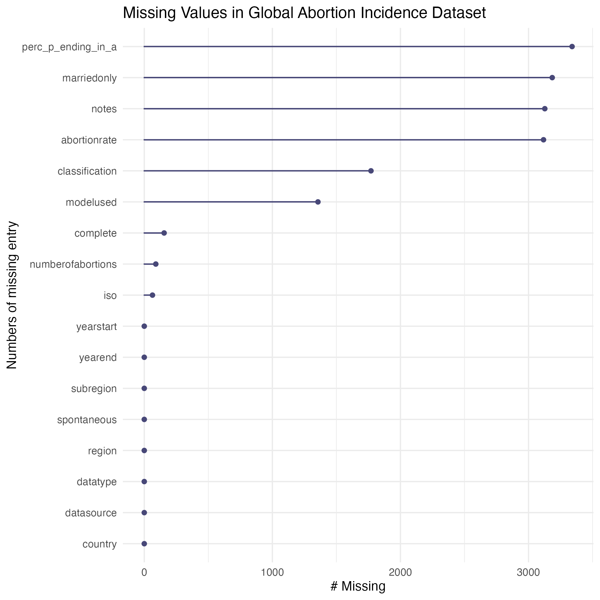{#fig-abortion-na}

### 2. Gender Inequality Index Dataset

The [Gender Inequality Index Dataset](https://www.kaggle.com/datasets/iamsouravbanerjee/gender-inequality-index-dataset) provides comprehensive insights into gender disparities across various dimensions of development. It contains **195 observations** and **40 variables**, including **34 numerical and 6 categorical variables** (@tbl-index-summary). Key metrics include `gender_inequality_index_(year)`, or GII, which measures disparities in health, education, and economic participation.^[GII calculated based on three primary dimensions: reproductive health, empowerment, and labor market] 
`iso3` variable is crucial for joining the dataset with geographic map provided by the the `rnaturalearth` package, enabling spatial analysis and comparison with other datasets like the [Global Abortion Incidence Dataset](https://osf.io/6t4eh). 


```{r}
#| label: tbl-index-summary
#| tbl-cap: "Summary statistics of the Gender Inequality Index Dataset"

load("figure_data/table_2_index_summary.rda")
index_summary
```

One of the dataset's challenges is the presence of missing data, with **1,428 missing values**, accounting for **18%** of the dataset  (@tbl-index-summary). These missing entries are unevenly distributed, with other earlier year-specific indices (`gender_inequality_index_1994` to `gender_inequality_index_2002`) showing most significant gaps (@fig-index-na). This problem may limit longitudinal analysis and impact the reliability of any trends or comparisons over time. Nonetheless, this dataset is invaluable for understanding global gender inequality. When compared with the map genderated by [Global Abortion Incidence Dataset](https://osf.io/6t4eh), the map of [Gender Inequality Index Dataset](https://www.kaggle.com/datasets/iamsouravbanerjee/gender-inequality-index-dataset) allows for meaningful exploration of the relationships between gender equality, abortion trends, and geography. This analysis will offer critical insights into how disparities in gender equality correlates with reproductive health outcome worldwide. 

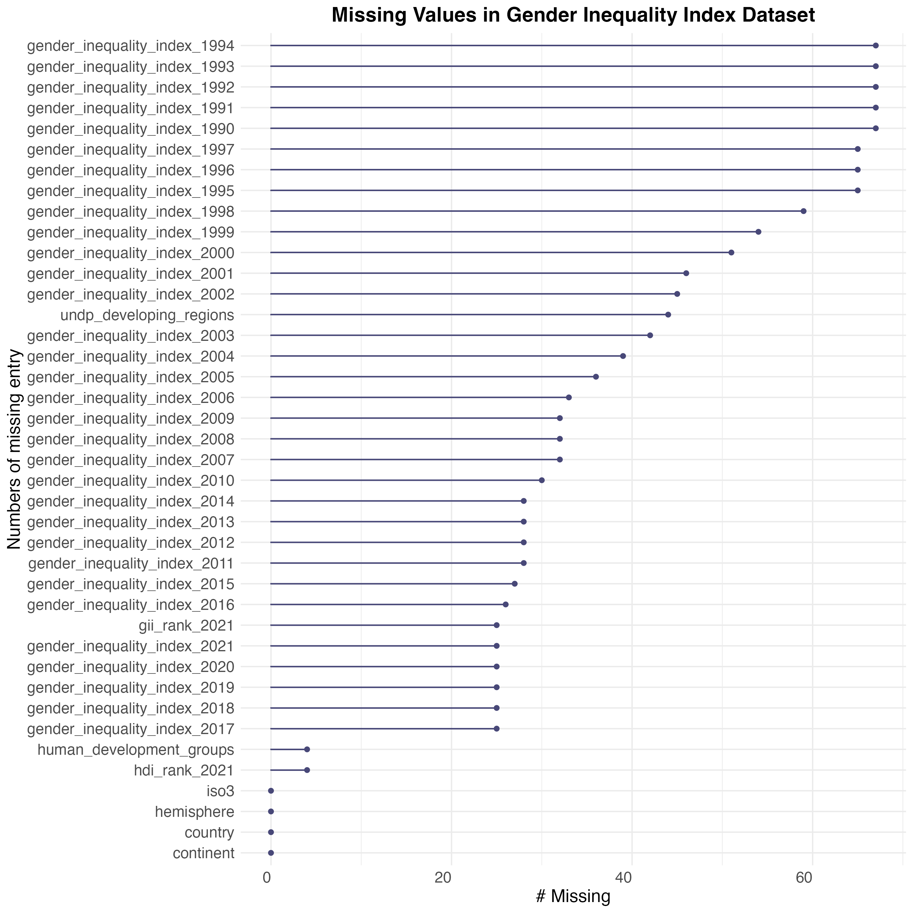{#fig-index-na}

### 3. Violence Against Women and Girls Dataset

The [Violence Against Women and Girls Dataset](https://www.kaggle.com/datasets/andrewmvd/violence-against-women-and-girls). provides critical insights into societal attitudes toward violence against women on developing countries. This dataset contains **12,600 observations** and **8 variables**, comprising **2 numerical and 6 categorical variables** (@tbl-violence-summary). The dataset includes survey data on various justifications for domestic violence, categorized into six groups: `With Reason`, `Parental Neglect`, `Autonomy Violation`, `Marital Conflict`, `Intimacy Denial`, and `Household Mistake`. The original survey responses were simplified and rephrased into these categories to provide a clear and concise summary of societal attitudes toward domestic violence in developing countries.

Focusing on developing countries, the [Violence Against Women and Girls Dataset](https://www.kaggle.com/datasets/andrewmvd/violence-against-women-and-girls) provides a valuable lens to examine systemic gender inequalities where they are most pronounced. By using this dataset to filter the[Gender Social Factors Dataset](https://www.kaggle.com/datasets/gianinamariapetrascu/gender-inequality-index/data), the analysis can concentrate on societal factors contributing to poor gender equality in the specific regions.^[For more information about this data filtering, refer to Technical Info in Appendix section] This targeted approach enhances the depth and relevance of the study by focusing on cultural norms and systemic barriers linked to gender inequality. 


```{r}
#| label: tbl-violence-summary
#| tbl-cap: "Summary statistics of the Domestic Violence Against Women Dataset"

load("figure_data/table_3_violence_summary.rda")
violence_summary
```

To expand its analytical potential and explore the relationship between violent opinions and reproductive rights, three new variables have been added: `iso`, `subregion`, and `abortion_access`. ^[iso provides a standardized country code for geographic integration. subregion reflects regional classification similar to those in the Global Abortion Incidence Dataset. abortion_access categorizes the availability of abortion services in each country. For more details about each category in abortion_access, refer to Technical Info in Appendix section.] These enhancements address the dataset's previous limitation of lacking direct connections to reproductive health metrics, enabling more comprehensive analyses of how societal attitudes toward violence intersect with abortion accessibility. 

The dataset presents some quality issue, with only **1,413 missing values**, accounting for **1%** of the total data (@tbl-violence-summary). Notably, most of these missing entries are in `value` variable, which represents the percentage of survey respondents supporting various justifications for violence (@fig-violence-na). This missingness could impact the analysis by introducing gaps in understanding societal attitudes in certain countries or categories. However, due to the dataset's overall size and its added variables, it becomes a powerful tool for visualizing and understanding how violent toleration correlate with abortion accessibility and gender inequality across developing countries. 


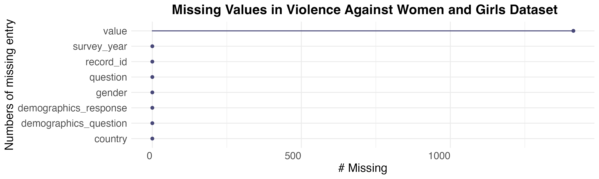{#fig-violence-na}

### 4. Gender Social Factors Dataset

The [Gender Social Factors Dataset](https://www.kaggle.com/datasets/gianinamariapetrascu/gender-inequality-index/data) offers a detailed examination of societal factors that influence gender inequality across **195 observations** and **11 variables** (@tbl-social-factor-summary). Among them, there are **9 numerical and 2 categorical variables**. Key variables include `m_secondary_educ` and `f_secondary_educ`, which highlight gender gaps in educational opportunities, and `maternal_mortality`, which reflects reproductive health outcomes. Additionally, `m_labour_force` and `f_labour_force` shed light on economic disparities, while `seats_parliament` captures the political representation of women. These variables collectively offer a comprehensive view of gender inequality. 


```{r}
#| label: tbl-social-factor-summary
#| tbl-cap: "Summary statistics of the Gender Social Factors Dataset"

load("figure_data/table_4_social_factor_summary.rda")

social_factor_summary

```


The dataset contains **133 missing values**, accounting for **6%** of the total data (@tbl-social-factor-summary). Missing values are primarily found in critical variable like `gii`, `m_secondary_educ`, `f_secondary_educ`, `m_labour_force`, or `f_labour_force` (@fig-social-factor-na). While these gaps may slightly impact the analysis, particularly in regression or trend evaluation, the relatively small percentage of missing data and the broad scope of coverage across countries help maintain the dataset's overall utility. 

The  [Gender Social Factors Dataset](https://www.kaggle.com/datasets/gianinamariapetrascu/gender-inequality-index/data) is particularly relevant for exploring how societal factors, such as education and maternal mortality, contribute to gender inequality. Its focus on both male and female education and reproductive health provides a nuanced understanding of systemic inequalities. By including only countries present in the[Violence Against Women and Girls Dataset](https://www.kaggle.com/datasets/andrewmvd/violence-against-women-and-girls), the analysis enables a more comprehensive exploration of the intersections among societal factors, gender inequality, and abortion laws in the developing regions. ^[For more information about this data filtering, refer to Technical Info in Appendix section]

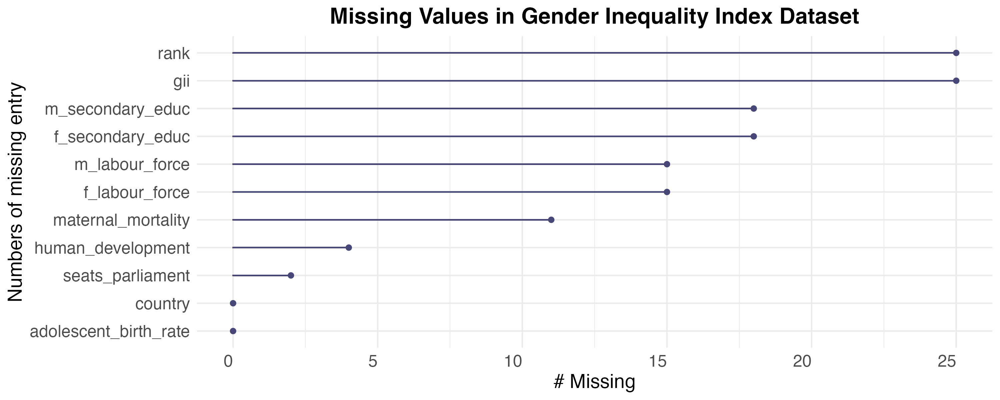{#fig-social-factor-na}

### 5. China Marriage and Divorce Dataset

The [China Marriage and Divorce Dataset](https://www.kaggle.com/datasets/tduan007/china-marriage-and-divorce-data/data) provides valuable insights into marital trends and family structure within China. With **31 observations** and **19 variables**, including **18 numerical and 1 categorical**, the dataset focuses on key factors such as marriage and divorce rates (@tbl-china-marital-summary). This data allows for a detailed analysis of how these trends related to societal structures and gender dynamics in China. 

```{r}
#| label: tbl-china-marital-summary
#| tbl-cap: "Summary statistics of the China Marriage and Divorce Dataset"

load("figure_data/table_5_china_marital_summary.rda")
china_marital_summary

```

To enhance its analytical utility, `area_type` has been added, which categorizes data as `urban` or `rural`.^[For more details about each category in area_type, refer to Technical Info in Appendix section.] This addition enabled more a more nuanced analysis, particularly in exploring how urban and rural differences influence marriage and divorce trends. By focusing on family structures and trends, the dataset offers a unique perspective on how societal pressures and family dynamics shape gender role in China.

One of the dataset's strength is its completeness, with **0 missing values**, ensuring a clean and straightforward analysis (@tbl-china-marital-summary). However, a notal limitation is that the dataset does not include data from all regions in China, which may affect its representativeness. This limited scope could influence the generalizability of the findings to the broader population, particularly in understanding regional variations.


## Explorations
### Gender Inequality and Abortion Patterns Worldwide

The exploration of global trends in `gender inequality` and `abortion rates` reveals a complex interplay of cultural norms, government policies, and access to reproductive health services. The analysis uncovers significant correlations between these variables, along with an unexpected case that sheds light on the intricate dynamics of gender equity and reproductive health policies across various regions.

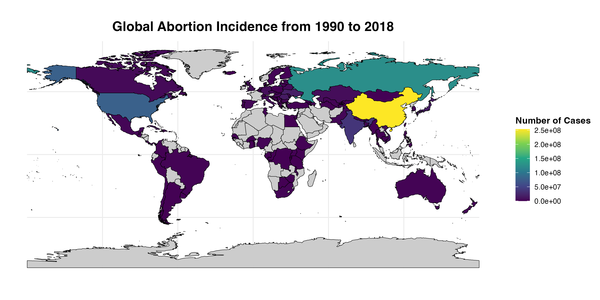{#fig-1-global-num}

Many regions in **Western Asia, Africa, Central, South, and Southeastern Asia** report very few abortion cases. Among the countries with available data, the numbers are relatively low, often falling below **50 million cases** over the 28-year period (@fig-1-global-num). Low incidences can have several implications. One is the possibility of under-reporting due to a lack of proper data collection systems and limited access to formal healthcare services where abortions might be recorded. In addition, restrictive abortion laws in many African and Central Asian countries may have driven the practice underground, indicating that actual abortion numbers could be much higher than reported.^[Singh et al., 2018] Cultural and religious attitudes toward abortion, which are often more conservative in these regions, also play a role in shaping these outcomes. As a result, the low reported incidence may reflect barriers to reproductive healthcare access and a lack of autonomy of women regarding reproductive choices. 

Most regions in Western Asia, Africa, Central, South, and Southeastern Asia exhibit **very high GII values**, with **GII levels often exceeding 0.5** (@fig-2-global-gender). These regions also report relatively low numbers and missing of recorded abortion cases (@fig-1-global-num). The high gender inequality in these areas suggests limited access to healthcare, low educational attainment, and minimal economic opportunities for women, collectively restricting women's agency over their reproductive choices. This pattern implies a correlation between gender inequality and abortion incidence, where high inequality restricts access to safe reproductive services, resulting in fewer recorder abortions. Moreover, the combination of restrictive abortion laws and prevailing socio-cultural norms, which often limit women rights, further prevents many women from seeking or affording safe abortion service.


{#fig-2-global-gender}
 

On the other hand, **China** stands out as the country with the highest number of reported abortions, with **over 250 million cases** reported during this period (@fig-1-global-num). The main reason for this high number are deeply rooted in China's historical population policy not only restricted family size but also pressured families into aborting unintended pregnancies to comply with the legal limit. Additionally, societal preferences for male children exacerbated the rate of sex-selective abortions. ^[Li & Miller, 2020]. Hence, despite China's relatively higher standing in terms of gender equality compared to other countries based on @fig-2-global-gender, the extremely high abortion rate suggests that state policies and deep-seated cultural norms have also influenced reproductive choices.

China's situation becomes even more notable when compared to countries in **Northern and Central Europe**, which are known for their progressive gender equality. These regions, with with significantly **lower GII values (below 0.2)**, also report some of the lowest number of abortion cases globally (@fig-2-global-gender, @fig-1-global-num). In contrast, **China with a moderate-to-low-GII (ranging from 0.2 to 0.4)**, exhibits an extremely high number of abortion (@fig-1-global-num). This discrepancy suggests that while Northern and Central Europe's smaller GII aligns with lower abortion rates, China's excessive number of abortions, despite having relatively low GII, may be driven by other factors, such as governmental policies, family, planning history, and healthcare accessibility. 


### Developing Nations in Africa and Asia: Persistent Gender Challenges from Socio-Political, Educational, and Health Inequities
#### 1. Persistent Socio-Political Gender Inequality

Tracking **GII from 1990 to 2021**, five countries—**Afghanistan, Yemen, Central African Republic, Papua New Guinea, and Nigeria**—stand out for having some of the highest levels of gender inequality in 2021. Over three decades, these nations have exhibited persistently high GII values, characterized by minor fluctuations and limited significant improvements.

`Afghanistan`, for instance experienced a minor increase in its GII from around **0.75** in 2005, reflecting heightened inequality coinciding with periods of intense conflict and shifting political regimes in the 2000s (@fig-2-afri-gender-time). The U.S invasion of Afghanistan in 2001 and the following years of war greatly impacted the social structure, limiting progress in gender equality.^[Swift, 2024] Despite, the gradual decline in GII after 2010, the country's GII remained consistently above **0.65**, unveiling the structural challenges continue to hinder gender parity. Furthermore, The GII of `Yemen` hovered between **0.75 and 0.83**, maintaining levels throughout the period (@fig-2-afri-gender-time). The escalation of Yemeni Civil War in 2014 played a pivotal role in maintaining or worsening gender inequality, with limited resources allocated for education and health, disproportionately affecting women rights and opportunities.^[Al-Hassani, 2023] In 2021, the country's GII approached close to **0.85**, reflecting the continued deterioration of social services, particularly those affecting women right, education, and healthcare.  


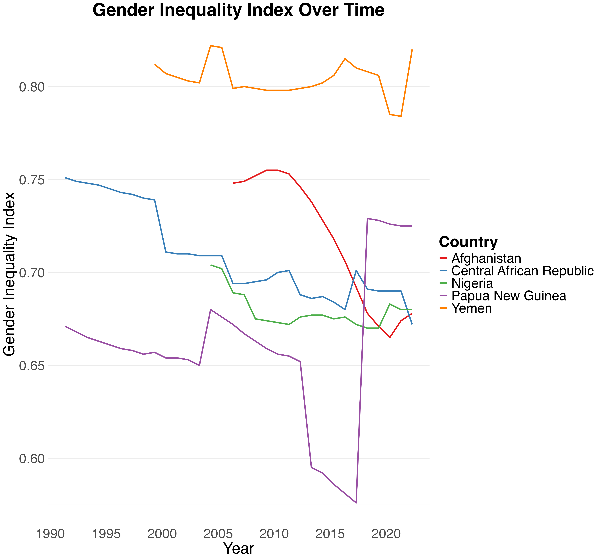{#fig-2-afri-gender-time}


`The Central African Republic (CAR)` also demonstrated a consistently high GII, with values ranging from approximately **0.75** in 1990 to **0.67** in 2021 (@fig-2-afri-gender-time). Despite some gradual improvement, progress has remained largely stagnant, reflecting recurring political instability, governance failures, and limited healthcare infrastructure The GII saw minimal declines over the decades, showing how persistent socio-political challenges continue to hinder women advancement. The small spike in GGII in the mid 2000s, reaching back to **0.70**, coincides with politic unrest and civil war in the country, which severely impacted the availability of social services, particularly those concerning women and children welfare.^[Guenard, 2024] `Nigeria`, although showing slightly declining trend, still maintained high GII values, decreasing from around **0.72** in the 1990s to **0.68** by 2021 (@fig-2-afri-gender-time). Regardless of the slight improvements, systemic barriers such as limited access to education and health care services, particularly in rural areas, continue to keep Nigeria among countries with substantial gender inequality.^[University of Sheffield, 2024] 

`Papua New Guinea` demonstrated the lowest GII among the five countries analyzed, starting at **approximately 0.68** in the early 1990s  (@fig-2-afri-gender-time). Although Papua New Guinea had the lowest gender inequality index in this group, it still fluctuated within a narrow range of **0.65 to 0.68** for more than two decades. In 2012, there was a significant improvement as the GII fell below **0.60**, reflecting some progress toward reducing gender inequality. However, this trend was not sustained, and the most pronounced fluctuation occurred after 2015, when GII values began to rise sharply again to **0.73**. The post-2015 increase in GII coincided with a deterioration in social conditions, which disproportionately affected women. Papua New Guinea's economic challenges intensified, with a lack of significant reforms to promote gender equality in economic participation and political representation. Additionally, cultural barriers and the absence of targeted government policies led to stagnation or even regression in women's rights. ^[Abay et al., 2024] The increase in GII after 2015 highlights that although Papua New Guinea might have started with relatively lower levels of inequality compared to the other countries, there remains a persistent inability to make sustainable progress in addressing gender disparities.

Systemic socio-political issues in Afghanistan, the Central African Republic, Yemen, Nigeria, and Papua New Guinea mirror broader regional trends across Africa, Central, South, and Southeast Asia, where social instability, economic challenges, and governance failures severely hinder progress toward gender equality. The high GII values in these regions highlight the direct impact on women's reproductive health and autonomy, restricting access to family planning and safe abortion services, while also underscoring persistent barriers to education, healthcare, and economic opportunities (@fig-1-afri-abor-access, @fig-2-global-gender).

#### 2. Women's Rights Limited by Educational Disparities

The distribution of `secondary education completetion rates` by `gender`  highlights notable disparities between males and females in developing regions across  Western Asia, Africa, Central, South, and Southeastern Asia. The completion rate for `females` reveals a pronounced right-skewed distribution, peaking between **10% and 30%** of completion. This skew indicates that a significant majority of women do not finish secondary education, with the curve demonstrating a steep decline after the initial peak (@fig-3-afri-compare-edu). Such a skew implies that many women face systemic obstacles in advancing beyond even the early stages of secondary education. The sharp decline and the low overall completion rates underscore how cultural norms, limited financial resources, and institutionalized gender biases directly hinder female educational attainment. As education is a fundamental enabler of personal empowerment and societal progress, this lack of access places women at a severe disadvantage in several dimensions of life, including their capacity for economic independence and decision-making power, particularly around reproductive health. Without the educational foundation to understand and assert their rights, women often face constrained options regarding family planning, leading to increased vulnerabilities related to reproductive health and unplanned pregnancies.

The male distribution exhibits a slightly different trend. The curve for `males` is still right-skewed but shows a broader spread, with its  peaks occurring **around 40% to 60%** of secondary education completion (@fig-3-afri-compare-edu). This pattern suggests that men in these regions are more likely to progress through middle school compared to women, though the rightward skew implies that even for men, many do not reach graduation. The more rightward position of the `male` density curve, along with its greater height compared to females between **40% and 100%**, indicates that a larger proportion of men complete their education (@fig-3-afri-compare-edu). This disparity in completion rates between males and females points to deeply ingrained societal norms that prioritize boys' education over girls'. The prioritization of male education reflects a cultural perspective that values men potential economic contributions more highly, while often relegating women to domestic roles with fewer opportunities for economic participating and decision-making power, whereas women remain largely dependent and excluded from such prospects.  

 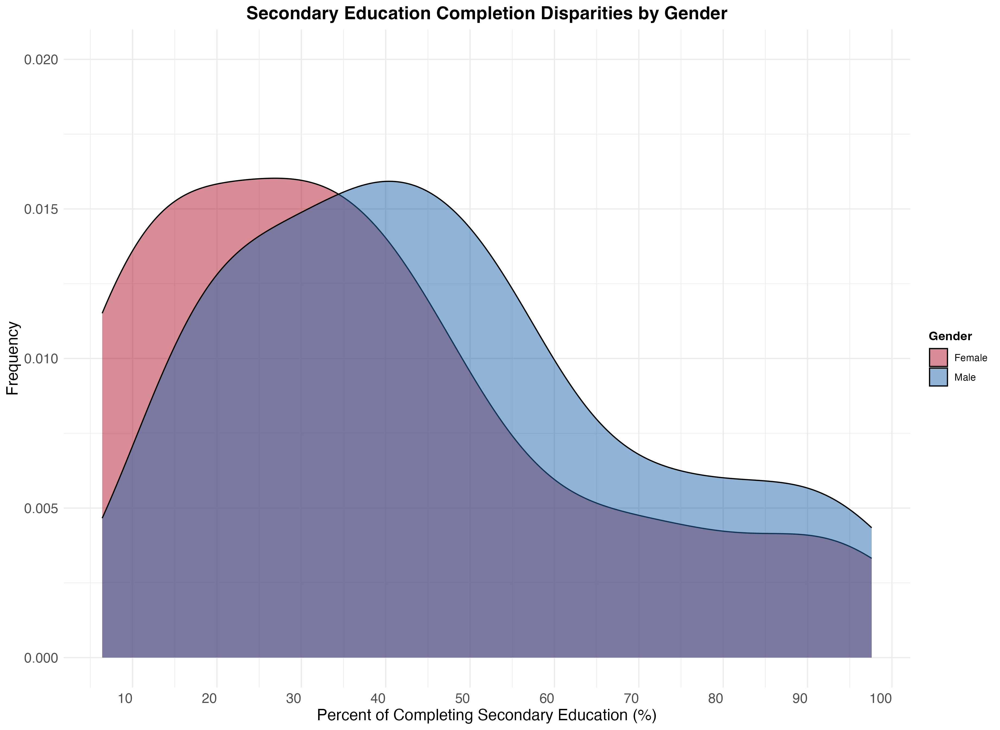{#fig-3-afri-compare-edu}


The deficiency of secondary education among women has cascading effects that significantly influence their autonomy and their health. Women with lower education are less likely to be informed about reproductive health services and to have access to family planning methods, which can lead to higher rates of unplanned pregnacies This gap is educational access also reinforces women subordinate status, making the more reliant on male partners and unable to negotiate the terms of their reproductive choices effectively. In developing regions with substantial gender gaps in education, these socio-cultural factors often contribute to a vicious cycle of poverty, early marriage, high fertility rates, and reduced female labor force participation — all of which further undermine women status.

Finally, the insufficient educational attainment of all citizens ultimately hinders social development in these countries. A population with limited education — especially the marked shortage of educated women—restricts overall national progress and curtails opportunities for meaningful economic and social advancement. This educational inadequacy serves as a significant barrier to improving reproductive health services, thereby directly affecting outcomes like maternal health and access to safe abortion services.


#### 3. Reproductive Rights Undermined by Domestic Violence Justifications

The data presented in @fig-6-afri-domes-opinion and @tbl-2-afri-just-violence offer critical insight into social attitudes toward domestic violence in developing countries in  Western Asia, Africa, Central, South, and Southeastern Asia, highlighting how these attitudes perpetuate gender inequality and restrict women rights, including their reproductive autonomy. These explorations serve as an extension of the previously discussed barriers to abortion and gender equality, illustrating another facet of systemic inequality: the widespread justification of domestic violence.

@fig-6-afri-domes-opinion illustrates public support for justifications of domestic violence, showing that violence is seen as an acceptable response to a range of perceived transgression by women. The most common justification, reported by **over 20% of respondents** is `With Reason` (@fig-6-afri-domes-opinion). This observation reflects a deeply entrenched belief in male authority, where men are perceived to have the right to control and discipline women, often via violence. Such beliefs are symptomatic of broader patriarchal norms, impacting women access to reproductive health services. When violence is culturally accepted as a means of control, women's agency is further diminished, limiting their ability to make decision about their bodies and health. 


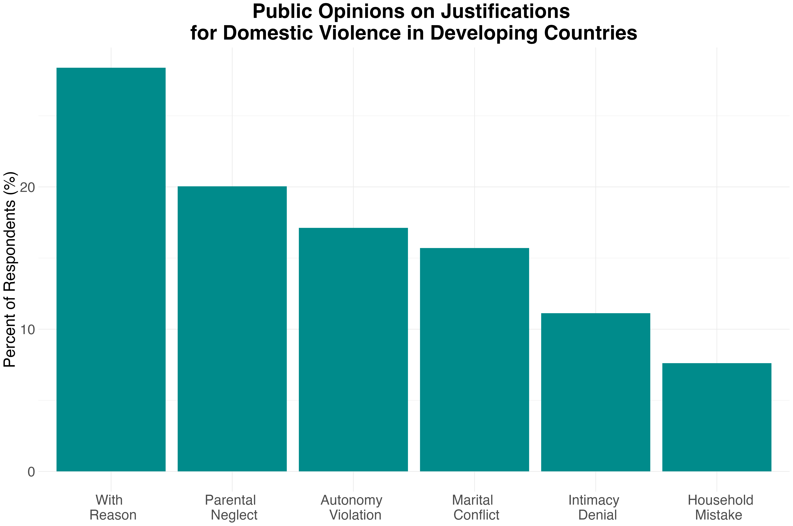{#fig-6-afri-domes-opinion}

@tbl-2-afri-just-violence provides a regional breakdown, emphasizing the varying prevalence of justifications for domestic violence across developing regions. `Sub-Saharan Africa` stands out, with **17.6% of individuals** citing `With Reason`, as a justification for violence - significantly higher than **3.9%** in `Central and Southern Asia` or **1.8%** in `Western Asia and Northern Africa` (@tbl-2-afri-just-violence). These figures highlight the deep-rooted patriarchal control that persists in certain societies, especially in regions burdened by significant socio-political challenges, like war and economic instability. ^[mentioned in 1. Persistent Gender Inequality in Developing Regions: Socio-Political Barriers to Women's Rights
] Such norms directly impact female reproductive rights, making it even harder for them to assert autonomy over their reproductive health and family planning decisions. 

The justification for violence based on `Parental Neglect` further demonstrates how deeply entrenched traditional gender roles are in the societies of these developing regions. Women are disproportionately held responsible for children, and any perceived failures are often met with violence repercussions. **12.3% of respondents** in `Sub-Saharan Africa` and **2.7%** in `Central and Southern Asia` endorsed this justification (@tbl-2-afri-just-violence). Such attitudes reinforce the perception that women's primary role is within the domestic sphere, limiting their opportunities to pursue education or employment and ultimately affecting their reproductive autonomy. Their earlier discussion on education disparities between genders in these regions further illustrates how a lack of educational opportunities confines women to traditional roles, exacerbating their vulnerability to gender-based violence and reducing their capacity to make independent decisions about their reproductive health.


```{r}
#| label: tbl-2-afri-just-violence
#| tbl-cap: "Regional Comparison of Justifications for Domestic Violence in Developing Countries (% of Respondents)."
#| 
load("figure_africa_asia/table_1_violence_subregion_category.rda")
violence_subregion_category
```

The endorsement of violence in cases of `Autonomy Violation` reveals an active resistance to women gaining independence. `Sub-Saharan Africa` reported **10.4% of respondents** supporting violence in response to a woman's assertion of autonomy, while `Central and Southern Asia` had **2.6%**. This reluctance to grant women agancy mirrors the limited access to reproductive health services discussed earlier (@tbl-2-afri-just-violence). When societal norms resist women's participation in decision-making and public life, access to essential health services, including abortion, becomes more challenging. This dynamic is evident in many of these regions, where patriarchal attitudes not only condone domestic violence but also shape policies that restrict women's health rights, reflecting a broader framework of control over women's bodies.

The prevalence of justification for violence related to `Marital Conflict` and `Intimacy Denial` points to the deeply rooted expectation that women must fulfill the demands of their husbands, even at the cost of their own well-being. `Central and Southern Asia` reported **2.3% of respondents**supporting violence in cases of `Marital Conflict`, while `Sub-Saharan Africa` reported **10.0%** (@tbl-2-afri-just-violence). Similarly, **7.6% of individuals** in `Sub-Saharan Africa` justified violence for `Intimacy Denial`, highlighting a pervasive belief that women have limited rights over their bodies. These attitudes directly impact women's reproductive autonomy; if women lack the power to refuse intimacy or negotiate within their marriages, they also lack the power to control if, when, and how they become pregnant. This further contributes to the high rates of unintended pregnancies and the resulting demand for abortion, which remains largely unmet due to restrictive laws and limited access to services in these regions.

#### 4. Maternal Mortality Aggravated by Restricted Abortion Access and Gender Inequality

The disparities in `maternal mortality` between developing regions and the global average are stark, revealing a troubling divide in healthcare access and quality. In `developing regions`, maternal mortality stands at a mean of **339 deaths per 100,000 live births**, which is more than double the `worldwide` mean of **160 deaths per 100,000 live births** (@tbl-2-afri-maternal-summary). This contrast indicates that women in these areas face a far higher risk of death during childbirth. This heightened risk can be attributed to inadequate healthcare infrastructure, lack of skilled medical personnel, limited maternal care services, and socio-economic barriers that prevent effective medical intervention. The median values are equally alarming, with maternal mortality in `developing regions` at **308**, compared to just **53** `globally` (@tbl-2-afri-maternal-summary). The drastic difference in median maternal mortality reflects the stark reality that maternal deaths are far more common in developing regions, and access to life-saving interventions remains a critical issue.


```{r}
#| label: tbl-2-afri-maternal-summary
#| tbl-cap: "Comparison of maternal mortality per 100,000 live births in 2021: Worldwide versus developing regions in Africa, Western, Central, South, and Southeastern Asia."

load("figure_africa_asia/table_2_maternal_summary.rda")
maternal_summary
```

These disparity in `mean` and `median`  have profound implications for women's reproductive rights and the broader issue of gender inequality in developing regions. High maternal mortality rates directly stem from a lack of access to quality reproductive healthcare, including skilled birth attendants and safe abortion services. This situation is worsened by restrictive abortion laws prevalent across developing countries in Africa, Western, Central, South, and Southeastern Asia (@fig-1-afri-abor-access). For women facing dangerous pregnancies, these restrictions often mean they cannot terminate the pregnancy safely, even when it poses a significant risk to their lives. This denial of access to necessary healthcare greatly increases the chances of maternal mortality from complications that could have been prevented if abortion services were available. Such restrictions ultimately strip women of the voice to make critical decisions about their health, exacerbating their vulnerability and reinforcing gender inequality.

Additionally, a lack of education among women in the developing countries significantly impacts maternal health outcomes. ^[mentioned in 2. Educational Inequalities in Developing Regions: Impacts on Women's Rights and Reproductive Health ] Women with limited education are less likely to be informed or aware of the importance of prenatal care, family planning, or the risks associated with childbirth, leading to higher rates of complications and maternal deaths. In these developing regions, the combination of restrictive abortion laws, limited family planning services, and inadequate educational opportunities often leads to high rates of unintended pregnancies, many of which culminate in unsafe, often illegal, abortions. These hazardous procedures significantly contribute to maternal mortality, particularly in areas where healthcare systems are unable to manage complications effectively. Consequently, the high maternal mortality rate is a direct outcome of limited reproductive autonomy, exacerbated by poor healthcare infrastructure and restrictive policies. This situation further entrenches gender inequality, depriving women of the opportunity to lead safe and healthy lives.

### China: An Unexpected Case of Persistent Internalized Sexism

China presents a unique case in the global discourse on gender inequality, highlighting both significant progress and persistent challenges. Its analysis provides critical insights into gender inequality, societal preferences, and their impacts on women's choices regarding marriage and family planning.


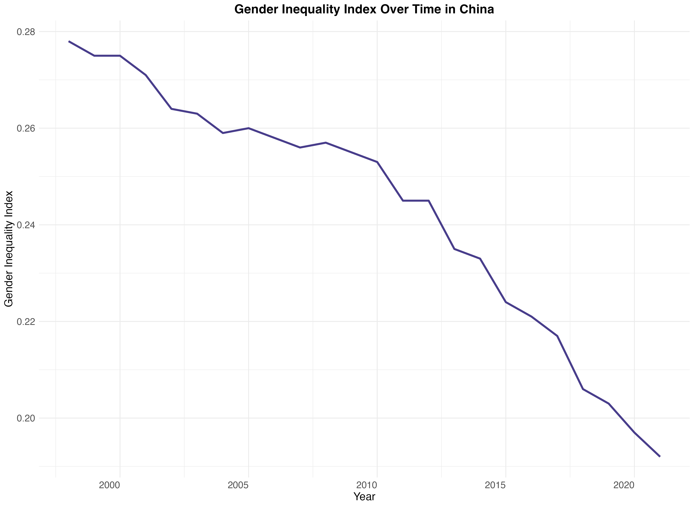{#fig-1-china-gender-index}


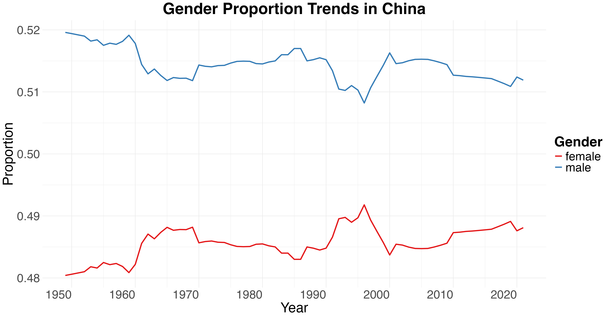{#fig-2-china-gender-pop}

The analysis of the GII in China from 1990 to 2021 reveals significant progress in reducing gender disparities. Over the past decades, the GII has steadily decreased, starting at around **0.28 before 2000s** and dropping to approximately **0.18 by 2021** (@fig-1-china-gender-index). This trend suggests that China has made strides in areas such as education, healthcare, and economic opportunities for women, contributing to overall improvements in gender equality. The reduction in GII reflects both policy efforts and broader societal changes, allowing for greater female participation in multiple domains of life. 

Despite the overall improvement in gender equality, a notable gender imbalance persists, as illustrated by the gender proportion in China from 1950 to 2021. The male population has consistently been higher than that of females, with the `male proportion` hovering around **0.52** and the `female proportion` around **0.48** (@fig-2-china-gender-pop). This discrepancy highlights the persistence of cultural biases favoring sons over daughters, a phenomenon driven by long-standing Confucian values that priotize male offspring for social and economic reasons. ^[Branigan, 2011] Such cultural preferences have had a tangible impact on reproductive choices, leading to sex selective abortions that account for China's high abortion rates (@fig-1-global-num). This internalized sexism-favoring the birth of boys over girls-exists despite significant advancements in women's access to education and employment opportunities. 


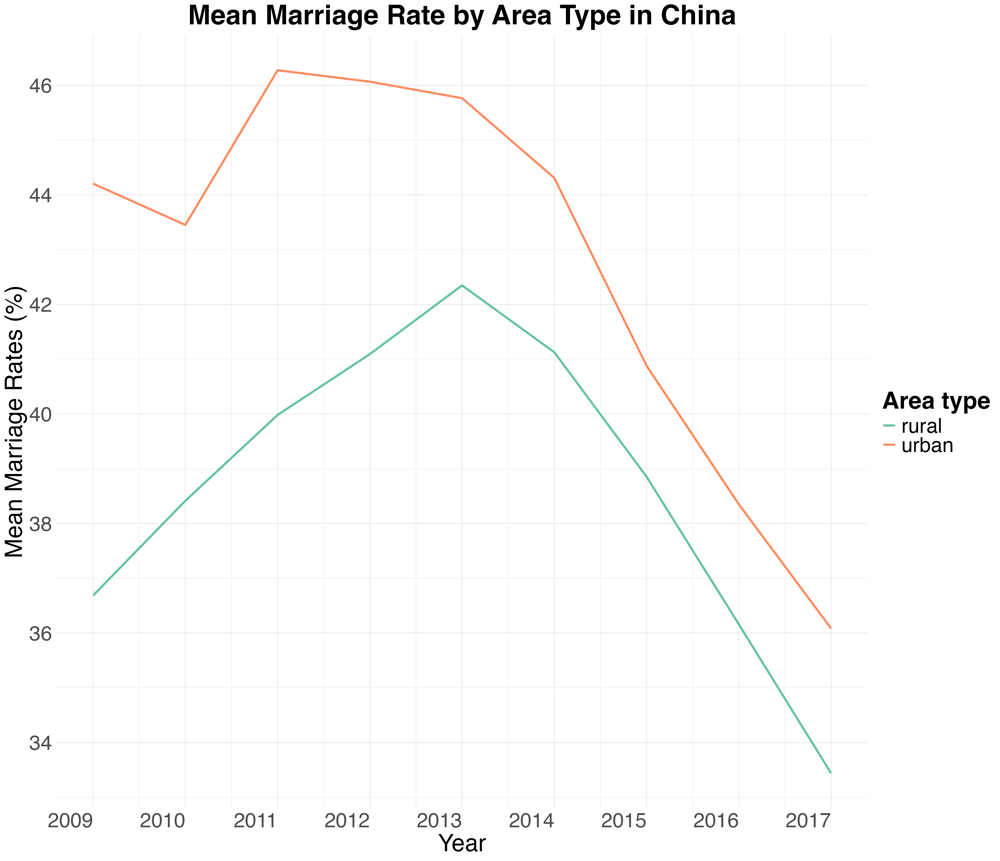{#fig-4-china-mean-marriage}

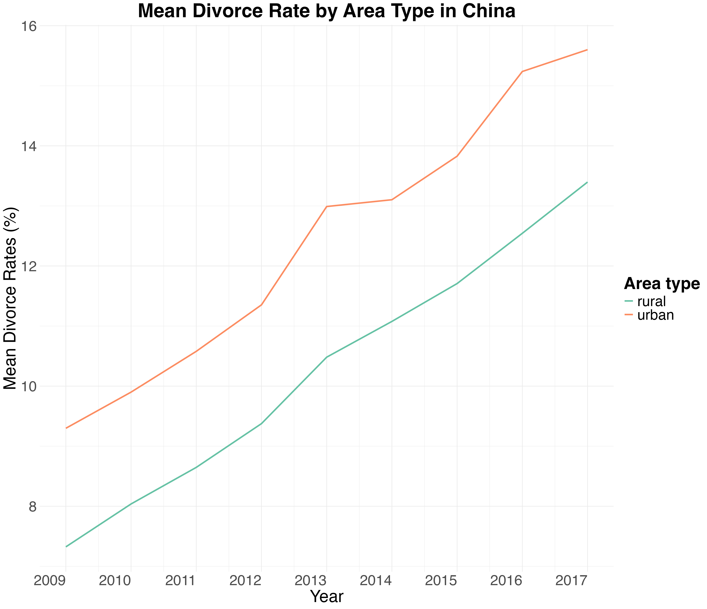{#fig-5-china-mean-divorce}

Marriage and divorce trends in China further reflect evolving gender dynamics and societal changes. Between 2009 and 2017, the `mean marriage rate` in `urban areas` fell sharply from **around 46% in 2013 to 36% by 2017**, while `rural areas` saw a similar decrease from **about 42% to under 34%** (@fig-4-china-mean-marriage). The decline in `marriage rate`, especially in urban settings, indicates a shift in societal attitudes towards marriage, potentially influenced by increased economic pressures and women's growing independence. Many women may also perceive marriage as lacking emotional and social support, leading them to delay or entire avoid it. Simultaneously, divorce rates in China have been on the rise. `Urban divorce rates` increased from about **10% in 2009 to nearly 16% in 2017**, while `rural divorce rates` also grew from **roughly under 8% to above 12% over the same period** (@fig-5-china-mean-divorce). The increasing divorce rates suggest that women are more willing to exit unsatisfactory marriage, even in rural areas where traditional values often discourage divorce. This trend points to a growing sense of agency among women, supported by better across to resources and legal rights, though it also reflects the challenges they face in finding supportive relationships in a society still influenced by patriarchal norms. 

## Conclusion

The EDA of global trends in gender inequality and abortion patterns underscore the intricate interplay between societal norms, policy frameworks, and access to healthcare. The findings reveal profound regional disparities in gender equality and reproductive health access, driven by cultural, educational, and political contexts. Several insights emerged from the analysis: 

### Global Trends in Gender Inequality and Abortion Rates

The global analysis of abortion patterns and gender inequality highlights stark regional disparities, revealing the intricate relationship between cultural norms, policy frameworks, and access to reproductive healthcare. Regions such as **Western Asia, Africa, and South and Southeastern Asia** demonstrate low reported abortion cases, often due to restrictive laws, cultural conservatism, and underreporting, while simultaneously grappling with high Gender Inequality Index (GII) values that limit women’s autonomy and access to healthcare. Conversely, **China’s** exceptionally high abortion rate, linked to its historical one-child policy and cultural preferences for male offspring, underscores how state policies and societal expectations significantly shape reproductive decisions, despite moderate GII levels. These findings emphasize the urgent need for targeted interventions to dismantle systemic barriers and address the intertwined challenges of reproductive healthcare and gender inequality on a global scale.

### Systemic Barriers to Gender Equality: Addressing Education, Healthcare, and Socio-Cultural Norms in Asia and Africa
#### Deep-Rooted Gender Inequality: Challenges in Developing Nations of Asia and Africa

The analysis of GII trends from 1990 to 2021 for Afghanistan, Yemen, Central African Republic (CAR), Papua New Guinea, and Nigeria exemplifies **the deeply entrenched nature of socio-political gender disparities of the developing countries in Asia and Africa.** Persistent conflicts, economic instability, governance failures, and cultural barriers collectively hinder progress toward gender parity in these nations. Despite minor improvements in certain periods, the overall trajectory reveals a troubling stagnation or worsening of conditions, with GII values remaining consistently high. These patterns highlights the pervasive structural and systemic challenges that disproportionately affect women living in developing regions, limiting their access to education, healthcare, and economic opportunities.

#### Educational Disparities and Their Impact on Gender Equality in Developing Region

The analysis of secondary education completion rates in 2021 reveals **significant educational disparities faced by women in developing regions across Western Asia, Africa, and Central, South, and Southeast Asia**. The pronounced right-skewed distribution for females illustrates systemic barriers that prevent most women from progressing beyond early secondary education (@fig-3-afri-compare-edu). These barriers—rooted in cultural norms, resource limitations, and entrenched gender biases—stifle personal empowerment and reinforce societal inequalities. In contrast, while men exhibit higher completion rates, their distribution also reflects notable drop-offs, indicating broader challenges in achieving universal education (@fig-3-afri-compare-edu). However, the rightward position and bigger frequency of the male completion curve underscores the persistent prioritization of male education, driven by societal norms that undervalue women's contributions and confine them to dependent roles with limited economic and decision-making power. The ripple effects of inadequate education for women are far-reaching, particularly in areas like reproductive health and family planning. Limited educational attainment restricts women’s access to critical information and services, leading to higher rates of unplanned pregnancies and perpetuating cycles of poverty, early marriage, and low workforce participation. These factors collectively entrench gender inequality and hinder national development across these regions.

#### The Impact of Domestic Violence Justifications on Women’s Rights and Reproductive Autonomy

The findings from @fig-6-afri-domes-opinion and @tbl-2-afri-just-violence highlight **the pervasive social acceptance of domestic violence in developing regions**, revealing how deeply entrenched patriarchal norms undermine women’s rights and autonomy, particularly in reproductive health. The widespread justification for violence, ranging from `With Reason` to `Intimacy Denial`, illustrates the systemic barriers women face in asserting control over their bodies and lives. These attitudes are not isolated but are deeply linked to cultural norms, economic instability, and governance failures that perpetuate gender inequality (@fig-6-afri-domes-opinion). Regional disparities, such as the significantly higher acceptance of justifications for violence in `Sub-Saharan Africa` compared to other regions, underscore the role of socio-political challenges in exacerbating these issues. Women in these settings are disproportionately confined to traditional roles, with limited access to education, employment, and reproductive health services. The endorsement of violence as a response to perceived autonomy violations or marital conflict highlights the resistance to granting women independence and agency, reinforcing cycles of dependency, poverty, and restricted reproductive choices.


#### Maternal Mortality and the Impact of Restricted Reproductive Healthcare Access

The stark disparities in maternal mortality between developing regions and the global average highlight **the profound effects of restricted reproductive healthcare access and entrenched gender inequality.**  With mean and  median of maternal mortality rates in developing regions  more than double the global numbers, the lack of robust healthcare infrastructure, skilled medical personnel, and accessible maternal care services stands out as a primary factor behind preventable deaths (@tbl-2-afri-maternal-summary). Restrictive abortion laws compound this crisis, denying women the ability to terminate pregnancies safely, even in life-threatening situations. This lack of access to safe and legal abortion services dramatically increases preventable maternal deaths from complications. The suppression of reproductive autonomy not only endangers women’s lives but also reinforces systemic gender inequality by depriving them of the ability to make crucial decisions about their health. Furthermore, the intersection of inadequate education and limited healthcare access exacerbates these challenges. Women with insufficient education are less likely to understand the importance of prenatal care, family planning, and the risks associated with childbirth, leading to higher rates of maternal complications and deaths.

#### Addressing Deep-Rooted Gender Inequality in Developing Regions

The persistent gender disparities across developing nations in Asia and Africa demand urgent and multifaceted solutions to dismantle systemic barriers to women’s equality. Tackling these issues begins with addressing educational disparities by prioritizing investments in girls' education and challenging cultural norms that undervalue their contributions. Providing access to quality, affordable education equips women with the tools to break cycles of poverty, make informed decisions about their reproductive health, and participate in economic and social development. 

Simultaneously, robust legal frameworks must be established to combat domestic violence and dismantle the cultural acceptance of such practices. Community-based programs can shift societal attitudes and empower women to assert their rights. Additionally, improving healthcare systems, particularly maternal and reproductive health services, is essential. Expanding access to skilled medical personnel, prenatal care, and safe abortion services ensures that women can make decisions about their bodies without fear of discrimination or harm.

To achieve sustainable progress, governments and international organizations must prioritize economic empowerment for women by creating opportunities for meaningful participation in the workforce and ensuring equal pay and workplace protections. By addressing the interconnected factors of education, healthcare, and socio-cultural norms, these regions can begin to dismantle the deeply entrenched gender inequalities that hinder both individual and societal growth.

### China’s Paradox: Progress in Gender Equality Amid Persistent Internalized Sexism

China presents **the complex case of gender dynamics where significant strides in gender equality coexist with deeply rooted internalized sexism.** The steady decline in China’s GII from 1990 to 2021 underscores notable progress in education, healthcare, and economic opportunities for women (@fig-1-china-gender-index). However, this progress is contrasted by the persistent gender imbalance in population ratios, driven by cultural preferences for male offspring. These biases, rooted in long-standing Confucian values, continue to influence reproductive choices, including sex-selective abortions, reflecting enduring societal pressures that prioritize sons over daughters.

Marriage and divorce trends further illustrate evolving gender roles in China. The decline in marriage rates, particularly in urban areas, highlights shifting attitudes toward traditional institutions as women gain greater economic independence and social autonomy (@fig-4-china-mean-marriage). Meanwhile, rising divorce rates suggest that women are increasingly willing to leave unsatisfactory relationships, even in rural areas where traditional values discourage such actions (@fig-5-china-mean-divorce). While this trend reflects growing agency among women, it also points to persistent challenges in achieving equitable and supportive partnerships in a society still shaped by patriarchal norms.

China’s case demonstrates that while policy efforts and social advancements can reduce measurable gender disparities, deeply entrenched cultural attitudes require more targeted and sustained efforts to foster genuine gender equity. Addressing internalized sexism and societal preferences will be crucial to ensuring that progress in education, employment, and legal rights translates into comprehensive gender equality in all aspects of life.

### Future Research Directions
A comparative analysis of gender dynamics in China, Japan, and South Korea could provide valuable insights into the role of internalized sexism in shaping reproductive choices, family structures, and broader societal trends. China' high abortion rates, driven by historical policies and cultural preferences for male offspring, contrast sharply with Japan and South Korea’s low birth rates, where economic pressures and evolving. China, Japan, and South Korea experience decreasing marriage rates, all strongly influenced by economic pressures and shifting gender roles.^[McCurry, 2024; Yamaguchi, 2024] This similarity underscores how societal expectations, economic realities, and cultural norms uniquely impact gender dynamics across these countries. China, Japan, and South Korea all share deeply ingrained Confucian values emphasizing male lineage and family continuity, which continue to shape reproductive choices and marriage patterns, even as urbanization and modernization challenge traditional structures. Additionally, all three countries face growing concerns over gender equality in the workplace, insufficient support for work-life balance, and the financial burden of raising children, which collectively discourage marriage and childbearing.

A key area of exploration is how internalized sexism interacts with these broader trends, influencing women’s autonomy in family planning and societal roles. In China, the preference for male childbirth has historically led to imbalanced gender ratios, which coupled with rapid socio-economic changes, affects marriage prospects and family formation. In Japan and South Korea, the emphasis on traditional gender roles within marriage often conflicts with younger generations’ aspirations for gender equality, contributing to delayed or avoided marriages and declining fertility rates. Another avenue of research involves the policy responses to these challenges. China's shift away from its one-child policy aims to address demographic imbalances but struggles to overcome deeply rooted cultural preferences. Meanwhile, Japan and South Korea have introduced various incentive to encourage marriage and childbearing, like childcare subsidies and parental leave policies, yet these measures often fall short of addressing structural barriers like workplace discrimination and the unequal distribution of domestic labor. 

Understanding these dynamics requires examining how internalized sexism perpetuates disparities in decision-making power, economic opportunities, and societal expectations across China, Japan, and Korea. By analyzing the intersections of cultural norms, this comparative study can provide valuable insights into strategies for promoting gender equality and understanding the causes of the reproductive crisis in East Asia.

## Appendix
### Reference

1. Abay, N. A., Kuehnast, K., Gordon Peake, G., & Demian, M. (2024, March 7). [Addressing gendered violence in Papua New Guinea: Opportunities and options](https://www.usip.org/publications/2024/03/addressing-gendered-violence-papua-new-guinea-opportunities-and-options ). United States Institute of Peace. 

2. Al-Hassani, M. (2023, October 27). [Yemeni women archive highlights women’s struggles during Yemen’s Civil War](https://themedialine.org/people/yemeni-women-archive-highlights-womens-struggles-during-yemens-civil-war/). The Media Line. 

3. Branigan, T. (2011, November 2). [China’s great gender crisis](https://www.theguardian.com/world/2011/nov/02/chinas-great-gender-crisis ). The Guardian.

4. C. Textor . (2024, November 11). [China: Urban and rural population by Province](https://www.statista.com/statistics/1088875/china-urban-and-rural-population-by-region-province/). Statista. 

5. Guenard, M. (2024, July 4). [What’s happening in the Central African Republic?](https://www.nrc.no/perspectives/2024/whats-happening-in-the-central-african-republic/) NRC. 

6. Johnson, S. (2024, December 2). [Beatriz v El Salvador: The abortion case that could set a precedent across Latin America](https://www.theguardian.com/global-development/2024/dec/02/el-salvador-antiabortion-international-campaign-disinformation-hate-activists-laws-ban-human-rights). The Guardian.  

7. Li, H., & Miller, G. (2020). [The Conflicted Legacy of China’s Population Policy.](https://doi.org/https://kingcenter.stanford.edu/sites/g/files/sbiybj16611/files/media/file/kingcenter_issuebrief_china.pdf) Stanford King Center on Global Development. 

8. Lussenhop, J. (2021, January 13). [Lisa Montgomery: Looking for answers in the life of a Killer](https://www.bbc.com/news/world-us-canada-55587260). BBC News. 

9. McCurry, J. (2024, February 28). [South Korea’s fertility rate sinks to record low despite $270bn in incentives](https://www.theguardian.com/world/2024/feb/28/south-korea-fertility-rate-2023-fall-record-low-incentives). The Guardian. 

10. O’Malley, S. (2002, February 15). [A cry in the dark](https://www.oprah.com/omagazine/andrea-yates-a-cry-in-the-dark/all). Oprah.com. 

11. Singh, S., Remez, L., Sedgh, G., Kwok, L., & Onda, T. (2018). [Abortion Worldwide 2017: Uneven Progress and Unequal Access](https://doi.org/10.1363/2018.29199). 

12. Specia, M. (2018, May 27). [How Savita Halappanavar’s death spurred Ireland’s Abortion Rights Campaign](https://www.nytimes.com/2018/05/27/world/europe/savita-halappanavar-ireland-abortion.html). The New York Times. 

13. Swift, J. (2024, February 29). [What did the US war and exit do for Afghan Women’s Rights?](https://genderpolicyreport.umn.edu/what-did-the-us-war-and-exit-do-for-afghan-womens-rights/?utm_source=chatgpt.com ) Gender Policy Report. 

14. University of Sheffield. (2024, June 7). [Colonialism and gender inequality: The case of political representation in Nigeria](https://phys.org/news/2024-06-colonialism-gender-inequality-case-political.html). PHYS.ORG.  

15. Yamaguchi, M. (2024, June 6). [Japan’s birth rate falls to a record low as the number of marriages also drops](https://thediplomat.com/2024/06/japans-birth-rate-falls-to-a-record-low-as-the-number-of-marriages-also-drops/ ). The Diplomat. 

16. I used [A ggplot2 Tutorial for Beautiful Plotting in R](https://www.cedricscherer.com/2019/08/05/a-ggplot2-tutorial-for-beautiful-plotting-in-r/) and *ChatGTP* to help make the graphs look presentable.

17. I used [Saving Data into R Data Format: RDS and RData](https://www.sthda.com/english/wiki/saving-data-into-r-data-format-rds-and-rdata) to help save and load the table.

18. I used [Introduction to rnaturalearth](https://cran.r-project.org/web/packages/rnaturalearth/vignettes/rnaturalearth.html) and  *ChatGTP* to help make the maps. 

19. I used *ChatGTP* to help my sentence flow better. 

### Technical Info
#### Targeted Analysis of the Gender Social Factor dataset

The legal framework of @fig-1-afri-abor-access provides a foundation for the analyses in @fig-3-afri-compare-edu, @tbl-2-afri-maternal-summary, and @fig-5-afri-birth-rate, which explore the impact of restricted abortion access on gender inequality and reproductive rights in these developing regions. The `country` variable in the[Gender Social Factors Dataset](https://www.kaggle.com/datasets/gianinamariapetrascu/gender-inequality-index/data) is filtered by the [Violence Against Women and Girls Dataset](https://www.kaggle.com/datasets/andrewmvd/violence-against-women-and-girls) using a `semi-join()`, narrowing the focus to Western Asia, Africa, Central, South, and Southeastern Asia—regions with the highest prevalence of abortion bans or severe restrictions (@fig-1-afri-abor-access). This filtering process directly informs the analyses, as @fig-3-afri-compare-edu, @tbl-2-afri-maternal-summary, and @fig-5-afri-birth-rate are products derived from this refined dataset. This targeted approach facilitates a deeper understanding of the connections between restrictive abortion laws, gender inequality, and societal factors in these regions.

#### Category of `abortion_access` in the [Violence Against Women and Girls Dataset](https://www.kaggle.com/datasets/andrewmvd/violence-against-women-and-girls)

`abortion_access` can be categorized into three  groups:^[Abortion law of each country is acknowledged through *Abortion worldwide 2017: Uneven progress and unequal access*]  

1. **Illegal or Extremely Restricted:**  
   This category includes countries where abortion is either entirely prohibited or allowed only to save the mother’s life. 

2. **Legal for Specific Reasons:**  
   In this category, abortion is permitted under specific conditions, such as cases of rape, incest, or severe fetal abnormalities.

3. **Legal on Request:**  
   This group encompasses countries where abortion is available without restrictions, typically up to a certain gestational age.

#### Category of `area_type` in the [China Marriage and Divorce Dataset](https://www.kaggle.com/datasets/tduan007/china-marriage-and-divorce-data/data)
`area_type` can be categorized into two groups:^[The categorization is acknowledged through *China: Urban and rural population by Province*]

1. **urban**
  The areas are characterized by significant urban development, large population, and advanced infrastructure. They include major cities and economically developed regions with a predominance of industrial, commercial, and service-oriented activities. These regions also offer better access to amenities like education, healthcare, and employment opportunities.
  
2. **rural**
  The areas are predominantly characterized by less urbanized development, smaller populations, and a focus on agricultural or natural resource-based economies. They have lower population densities, fewer infrastructure facilities, and limited access to advanced healthcare, education, and employment opportunities compared to urban areas. 

### Extra Exploration
#### Developing Nations in Africa and Asia:

```{r}
#| label: tbl-1-top-5
#| tbl-cap: "Top 5 Countries with the Highest Gender Inequality in 2021"


load("figure_africa_asia/table_1_top_5_gender_inequality.rda")
top_5_gender_inequality
```
@tbl-1-top-5 lists the countries with the highest GII in 2021, providing specific ranks and highlighting their status in global developmental contexts. The countries listed - Yemen, Papua New Guinea, Nigeria, Afghanistan, and the Central African Republic—feature among the lowest in human development indices and have significant disparities in gender equality.


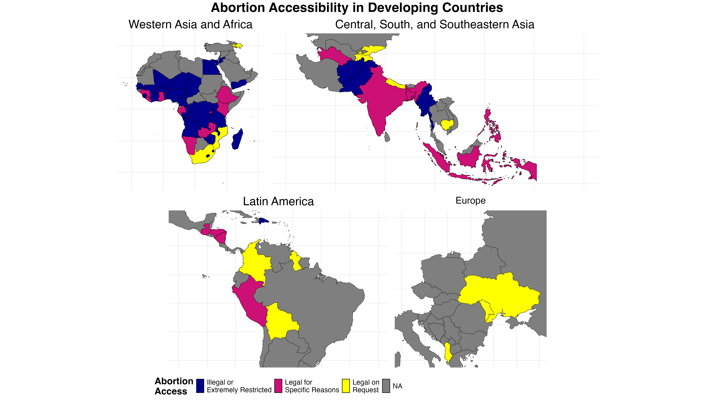{#fig-1-afri-abor-access}


@fig-1-afri-abor-access illustrates the accessibility of abortion across developing countries in various regions. The map highlights that abortion is either illegal or heavily restricted in many areas of Western Asia, Africa, Central, South, and Southeastern Asia, represented by the widespread dark blue regions. In some areas, abortion is permitted only under specific circumstances, shown in pink. 

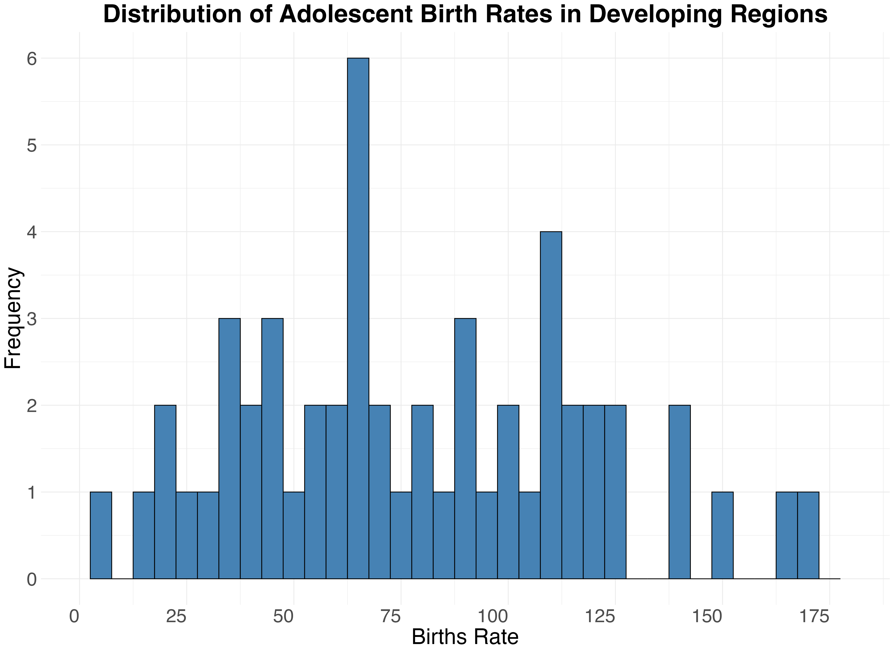{#fig-5-afri-birth-rate}

The distribution of adolescent birth rates in developing regions, as shown in @fig-5-afri-birth-rate, exhibits several notable characteristics. The histogram appears to have a roughly unimodal distribution with the highest peak is at approximately 70 births per 1,000 women, indicating that this birth rate is more common among adolescent women in the sampled regions. There is considerable variability, with birth rates ranging from 0 to over 175 births per 1,000 women, indicating significant differences in adolescent fertility rates across the regions. The distribution does not show any strong skewness, but there are pronounced clusters at lower to mid-range values (between 25 and 120), suggesting variability within different parts of the developing regions, which may be influenced by socio-cultural and economic factors affecting adolescent reproductive health.

#### China

```{r}
#| label: tbl-1-china-gender-index
#| tbl-cap: "Key Indicators of Gender Development in China in 2021."

load("figure_china/table_1_china_global_rank.rda")
china_global_rank
```

@tbl-1-china-gender-index provides key indicators of gender development in China for 2021. China is classified within the `High` Human Development Group, with a Human Development Index Rank of **79**. GII Rank stands at **48**, reflecting considerable progress in gender equality. Maternal mortality is notably low, at **29** deaths per 100,000 live births, indicating improvements in maternal healthcare. Education access for women is strong, with **78.3%** of females holding a secondary education degree . However, female labor force participation remains relatively moderate at **61.6%**, suggesting barriers to full economic integration despite advancements in education and health.

## Executive summary
The ***Of Rights and Wrongs: Unearthing Global Gender Inequalities and Reproductive Struggles*** report examines the systemic challenges faced by women globally, emphasizing the interconnection of societal norms, policy frameworks, and access to healthcare in shaping gender inequality and reproductive health.Through data analysis, the report examines regional disparities in gender equality, emphasizing societal factors and their impact on women’s rights, health, and autonomy. The findings underline the importance of targeted interventions to address these systemic barriers and foster equity across diverse cultural and political contexts 

### 1. Introduction
Motivated by cases such as Lisa Montgomery in the U.S. and Beatriz in El Salvador, this document contextualizes these individual tragedies within broader global patterns of neglect and systemic inequality. These stories reveal devastating consequences of untreated trauma, insufficient healthcare, and restrictive reproductive policies,highlighting the urgent need for action to safeguard women’s rights and well-being. Therefore, the document investigate global pattern in gender inequality and reproductive health, focusing on how restrictive aboriton laws, inadequate education, and societal norms perpetuate systemic challenges for women. 


### 2. Aim 

The primary goal of this report is to uncover and analyze the systemic barriers that women face globally, with an emphasis on reproductive rights, societal inequality, and health outcomes. By examining these interconnected challenges, the report aims to identify underlying patterns and root causes, ultimately providing actionable insights to inform policies and interventions that promote equity and safeguard women's health and autonomy. Specifically, the study aims to uncover the relationship between restrictive abortion laws and gender equality, focusing on how sociol political influence health outcomes and gender inequality for women in developing regions of Africa and Asia. It also investigates the impact of societal attitudes, such as tolerance for domestic violence, on women’s autonomy and decision-making. Additionally, the report analyzes trends in education, violence, and healthcare to provide evidence-based recommendations for advancing gender equality and improving access to reproductive rights.


### 3. Methodology

The study employs a comprehensive framework to analyze the global patterns of abortion cases and gender inequality, integrating  diverse datasets and visualization techniques to uncover key trends and regional disparities. Starting with a global overview, abortion cases and GII are mapped to identify areas of concern. China, characterized by its high number of reported abortion cases, is examined in detail to explore the societal impacts of its one-child policy (1979–2015), including its effects on gender distribution and social dynamics such as marriage and divorce trends (@fig-1-global-num). In regions like Africa, South, Central, and Southeastern Asia, where abortion cases are low or underreported and GII values are high, the analysis focuses on socioeconomic factors - education, societal attitudes toward domestic violence, and maternal mortality to identify systemic barriers (@fig-1-global-num, @fig-2-global-gender). Key methods include tracking GII trengs over time with line graphs, visualizing secondary education disparities between gender using density curve, and summarizing maternal mortality rates with statistical measures. 

### 4. Findings

This report highlights systemic barriers to gender equality and reproductive health globally, focusing on persistently high GII values in regions like Afghanistan and Yemen, where women face limited access to health and education. Education disparities, particularly restricted access to secondary education, perpetuate traditional gender roles and hinder women's autonomy and empowerment. The widespread acceptance of domestic violence correlates with restricted reproductive rights, reinforcing cycles of inequality and dependency. High maternal mortality rates in developing regions, driven by restrictive abortion laws and inadequate healthcare, further underscore the critical gaps in reproductive health services. Meanwhile, in China, cultural preferences for male offspring continue to influence societal and family dynamics despite policy reforms, reflecting the enduring impact of deeply ingrained gender biases. Collectively, these findings reveal the urgent need for targeted interventions to address systemic inequities and promote gender equality across diverse contexts. 

### 5. Recommendations

Addressing gender inequality in developing regions of Asia and Africa requires a comprehensive approach targeting education, healthcare, and cultural norms. Investing in girls' education and challenging societal biases can empower women with the tools to escape poverty and make informed reproductive choices. Simultaneously, legal reforms and community programs must combat domestic violence and shift cultural acceptance of harmful practices. Strengthening healthcare systems, including access to skilled maternal care and safe abortion services, is vital for safeguarding women’s health and autonomy. In parallel, examining gender dynamics in countries like China, Japan, and South Korea through comparative analysis could provide valuable insights into how internalized sexism shapes reproductive choices, family structures, and societal trends. By addressing these interconnected issues and prioritizing women’s economic empowerment and equal opportunities, these efforts can collectively dismantle systemic barriers, promote gender equity, and create a more inclusive and equitable society.

### 6. Summary and Implications

This report emphasizes the critical need to address systemic barriers to gender equity, including restrictive abortion laws, through comprehensive policy reforms, advancements in education, and transformative societal changes. Ensuring autonomy and access to reproductive rights dismantles entrenched inequalities and supports sustainable global development.