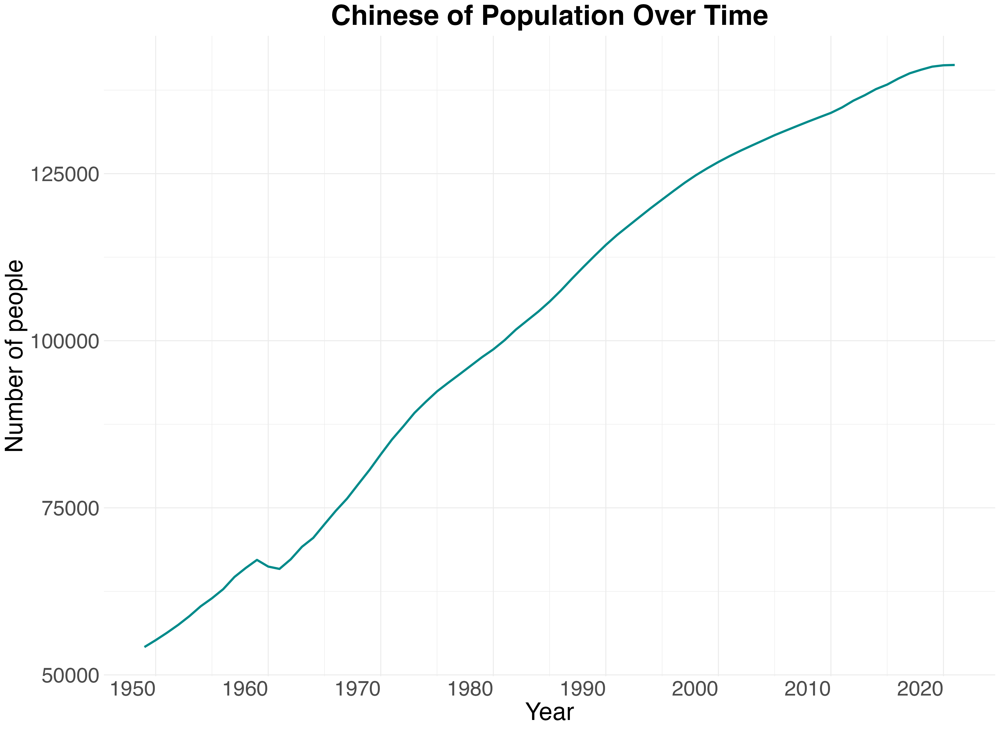

::: {.callout-tip icon=false}
## Github Repo Link

[Tran Chau's Final Project Github Repo](https://github.com/stat301-1-2024-fall/final-project-1-bunmam-ctrl.git)

:::


## Introduction
### Motivation: Exploring Systemic Challenges for Women Globally
High-profile cases such as *United States v. Lisa Montgomer* and *Texas v. Andrea Yates* starkly illustrated the devastating consequence of neglecting women's mental health, reproductive rigths, and socioeconomic struggles. Lisa Montgomery, who was executed for a captain crime, endured years of severe physical and sexual abuse by her family, untreated mental health, and profound trauma. Her suffering was exacerbated by being forced to carry an unwanted pregnancy and later coerced into sterilization by her husband. This trauma intensified contributed to her development of multiple mental illnesses, including bipolar disorder, complex post-traumatic stress disorder, dissociative disorder, and traumatic brain injury. ^[https://www.bbc.com/news/world-us-canada-55587260] Similarly, Andrea Yates, suffering from severe postpartum psychosis, tragically took the lives of her five children after enduring significant mental health challenges. Her struggles were worsened by her husband's refusal to permit her an abortion, compelling her to undergo pregnancy she was not emotionally or physically equiped to handle. The accumulation of repeated traumas, insufficient mental health care, and a lack of family support culminated in a devastating tragedy within the Yates'family. ^[https://www.oprah.com/omagazine/andrea-yates-a-cry-in-the-dark/all]

These cases are not isolated: they represent broader systemic failings faced by women around the world. In 2012, Savita Halappanavar, a 31-year-old Irish-Indian dentist, died of sepsis after being denined a life-saving abortion during a miscarriage. Despite her deteriorating conditon, doctors refused to terminate the pregnancy while the fetus still had a heartbeat, due to Ireland's restrictive abortion laws at the time. ^[cite] In 2013, Beatriz, a 22-year-old Salvadoran woman with lupus, was denied with a life-saving abortion even though her pregnancy was non-viable and posed a severe threat to her life. El Salvador's total abortion ban forced her to carry the pregnancy for months, subjecting her to severe health risks.^[https://cejil.org/comunicado-de-prensa/iachr-demands-explanations-from-el-salvador-over-beatriz-case/].

The stories above highlight how the refusal to provide essential healthcare reveals deeply entrenched systemic failings that disproportionately affect women, particularly in reproductive rights. Their tragic outcome also underscore the devastating consequences of restrictive abortion laws and the profound gender inequality inherent in systems that prioritize legal and societal norms over women’s health, autonomy, and lives. The lack of equitable access to medical care not only aggravate physical and mental health issues but also perpetuates broader patterns of gender inequality by denying women the agency to make decisions about their own bodies and futures. 

The cases also reflect the far-reaching consequences of untreated trauma, inadequate social and familial support network, and systemic barriers to reproductive healthcare. Women who are denined the ability to make choices about their reproductive health often face compounded challenges, like worsened socioeconomic conditions, diminished mental well-being, and reduced opportunities for education and employment. These barriers are not confined to individual experience but are indicative of widespread global patterns where systemic inequitites restrict women's access to care, reinforcing cycles of poverty, violence, and discrimination.

The EDA analysis, hence, aims to delve deeper into these connected issues, examining how similar challenges manifest across diverse cultural, legal, and political contexts. By identifying global pattern of violence, inequality, and reproductive health disparities, the project seeks to illuminate the underlying factors that contribute to these injustices. Additionally, it aspires to provide actionable insights that can guide policies and initiatives designed to address these systemic failings. The ultimate goal is to foster interventions that promote equity, dignity, and well-being for women, ensuring that their rights and health are safeguarded regardless of geographic or societal boundaries This approach not only addresses the immediate needs of women but also works toward dismantling the structural barriers that perpetuate gender inequality on a global scale. 

### Data Sources: Comprehensive Overview

To tackle these challenges and build a holistic understanding, the analysis draws on a diverse array of datasets, each contributing a unique perspective on the issues at hand. 

1. The  [Global Abortion Incidence Dataset](https://osf.io/6t4eh) provides detailed data on abortion cases worldwide, grouped by country, socioeconomic conditions, and healthcare accessibility. It also includes insights into the legal frameworks, cultural attitudes, and public sentiment surrounding abortion. This dataset is vial for understanding reproductive rigths and access to healthcare as foundational aspects of women's agency.

2. The [Gender Inequality Index Dataset](https://www.kaggle.com/datasets/iamsouravbanerjee/gender-inequality-index-dataset) offers a quantitative measure of disparities between genders in health, education,  and economic participation. The `Gender Inequality Index (GII)` is calculated by using key indicators such as maternal mortality rates, adolescent birth rates (reflecting productive health), educational completion, and labor force participation. By offering insights into these dimensions, the dataset highlights systemic inequities and their implications for women's opportunities, empowerment, and overall quality of life across nations. 

3. The [Violence Against Women and Girls Dataset](https://www.kaggle.com/datasets/andrewmvd/violence-against-women-and-girls) explores attitudes toward violence against women and girls, including societal tolerance for domestic abuse, sexual harassment, and human trafficking. By grouping data by region, age group, and socioeconomic status, it provided critical insights into the prevalence of violence and the cultural norms and sytemic inequities that perpetuate it. This information is invaluable for understanding the societal acceptance of violence, identifying risk factors, and designing targeted interventions to challenge harmful attitudes and reduce violence against women.

4. The [Gender Social Factors Dataset](https://www.kaggle.com/datasets/gianinamariapetrascu/gender-inequality-index/data) delves into societal elements that influenced gender disparities such as education, cultural norms, and policy frameworks. It includes variables of family dynamics, social attitudes, and gender roles, offering insights into the root causes of inequalities. This dataset helps reveal the broader societal structures that perpetuate gender-based challenges.

5. The [China Marriage and Divorce Data](https://www.kaggle.com/datasets/tduan007/china-marriage-and-divorce-data/data) provides insights into marital and familial trends within the Chinese context. This dataset explore how societal pressures and family structures influence gender roles, economic participation, and mental health. Understanding these trends is key to identifying societal barriers that limit women’s autonomy and well-being. 

6. The [China Population by Gender and Urban/Rural Dataset](https://www.kaggle.com/datasets/concyclics/chinas-population-by-gender-and-urbanrural/data  ) focuses on demographic distribution in China, segmented by gender and region. This dataset highlights the unique challenges  faced by women in specific cultural and geographic contexts, particularly in balancing urbanization and traditional norms.  By analyzing these dynamics, the analysis can uncover how regional differences affect women’s rights and opportunities.


## Data Overview and Quality
### Global Abortion Incidence Dataset

```{r}
#| label: tbl-abortion-summary
#| tbl-cap: "Summary Statistics of the Global Abortion Incidence Dataset"

load("figure_data/table_1_abortion_summary.rda")
abortion_summary
```
{#fig-abortion-na}

### Gender Social Factors Dataset

```{r}
#| label: tbl-social-factor-summary
#| tbl-cap: "Summary Statistics of the Gender Social Factors Dataset"

load("figure_data/table_4_social_factor_summary.rda")

social_factor_summary

```


{#fig-social-factor-na}

## Explorations
### Gender Inequality and Abortion Patterns Worldwide

The exploration of global trends regarding `gender inequality` and `abortion rates` highlights a complex interplay between cultural norms, government policies, and access to reproductive health services. The analysis, as presented by @fig-1-global-num and @fig-2-global-gender, unveils a notable case and significant correlations and between these two variables that elucidate the complexities of gender dynamics and reproductive health policies across different regions. 

{#fig-1-global-num}


{#fig-2-global-gender}
 
 
 @fig-1-global-num highlights the global distribution of abortion cases between 1990 and 2018, with **China** standing out as the country with the highest number of reported abortions, indicated by the bright yellow color on the map. The magnitude of abortion cases in China is striking, with **over 250 million cases** reported during this period. The main reason for this high number are deeply rooted in China's historical population policy not only restricted family size but also pressured families into aborting unintended pregnancies to comply with the legal limit. Additionally, societal preferences for male children exacerbated the rate of sex-selective abortions. Despite China's relatively higher standing in terms of gender equality compared to other countries based on @fig-2-global-gender, the high abortion rate suggests that state policies and cultural factors have significantly influenced reproductive choices. ^[https://kingcenter.stanford.edu/sites/g/files/sbiybj16611/files/media/file/kingcenter_issuebrief_china.pdf]

China's situation becomes even more notable when compared to countries in **Northern and Central Europe**, which are known for their progressive gender equality. These regions, indicated on @fig-2-global-gender with significantly **lower GII values (below 0.2)**, also report some of the lowest number of abortion cases globally based on @fig-1-global-num. In contrast, **China with a moderate-to-low-GII (ranging from 0.2 to 0.4)**, exhibits an extremely high number of abortion (@fig-1-global-num). This discrepancy suggests that while Northern and Central Europe's smaller GII aligns with lower abortion rates, China's excessive number of abortions, despite having relatively low GII, may be driven by other factors, such as governmental policies, family, planning history, and healthcare accessibility. 


On the other hand, @fig-1-global-num also demonstrates that many regions in **Western Asia, Africa, Central, South, and Southeastern Asia** have very few reported abortion cases, represented by dark purple. The countries that do report data show relatively low numbers, often below **50 million cases** over the 28-year-period. Thus low incidences can have several implications. One is the possibility of underreporting due to a lack of proper data collection systems and limited access to formal healthcare services where abortions might be recorded. In addition, restrictive abortion laws in many African and Central Asian countries may have driven the practice underground, indicating that actual abortion numbers could be much higher than reported.^[https://www.guttmacher.org/sites/default/files/factsheet/ib_aww-africa.pdf] Cultural and religious attitudes toward abortion, which are often more conservative in these regions, also play a role in shaping these outcomes. As a result, the low reported incidence may reflect barriers to reproductive healthcare access and a lack of autonomy of women regarding reproductive choices. 

Most regions in Western Asia, Africa, Central, South, and Southeastern Asia exhibit **very high GII values**, as majorly represented by the greenish and yellowish shades in @fig-2-global-gender , with **GII levels often exceeding 0.5**. These regions also report relatively low numbers and missing of recorded abortion cases (@fig-1-global-num). The high gender inequality in these areas suggests limited access to healthcare, low educational attainment, and minimal economic opportunities for women, collectively restricting women's agency over their reproductive choices. This pattern implies a correlation between gender inequality and abortion incidence, where high inequality restricts access to safe reproductive services, resulting in fewer recorder abortions. Moreover, the combination of restrictive abortion laws and prevailing socio-cultural norms, which often limit women rights, further prevents many women from seeking or affording safe abortion service. 

### China: An Examplary Case of Persistent Internalized Sexism

 @fig-1-china-gender-pop, @fig-2-china-gender-pop, @fig-4-china-mean-marriage, @fig-5-china-mean-divorce, and their analyses reveal critical insigits into gender inequality, societal preferences, and their impacts on women choice regarding marriage and family planning in China. 


{#fig-1-china-gender-pop}


{#fig-2-china-gender-pop}

The analysis of the GII in China from 1990 to 2021 reveals significant progress in reducing gender disparities. Over the past decades, the GII has steadily decreased, starting at around **0.28 before 2000s** and dropping to approximately **0.18 by 2021** (@fig-1-china-gender-pop). This trend suggests that China has made strides in areas such as education, healthcare, and economic opportunities for women, contributing to overall improvements in gender equality. The reduction in GII reflects both policy efforts and broader societal changes, allowing for greater female participation in multiple domains of life. 

Despite the overall improvement in gender equality, a notable gender imbalance persists, as illustrated by the gender proportion in China from 1950 to 2021. The male population has consistently been higher than that of females, with the `male proportion` hovering around **0.52** and the `female proportion` around **0.48** (@fig-2-china-gender-pop). This discrepancy highlights the persistence of cultural biases favoring sons over daughters, a phenomenon driven by long-standing Confucian values that prioritze male offspring for social and economic reasons ^[https://www.theguardian.com/world/2011/nov/02/chinas-great-gender-crisis]. Such cultural preferences have had a tangible impact on reproductive choices, leading to sex selective abortions that account for China's high abortion rates (@fig-1-global-num). This internalized sexism-favoring the birth of boys over girls-exists despite significant advancements in women's access to eduation and employment opportunities. 


{#fig-4-china-mean-marriage}

{#fig-5-china-mean-divorce}

Marriage and divorce trends in China further reflect evolving gender dynamics and societal changes. Between 2009 and 2017, the `mean marriage rate` in `urban areas` fell sharply from **around 46% in 2013 to 36% by 2017**, while `rural areas` saw a similar decrease from **about 42% to under 34%** (@fig-4-china-mean-marriage). The decline in `marriage rate`, especially in urban settings, indicates a shift in societal attitudes towwards marraige, potentially influenced by increased economic pressures and women's growing independence. Many women may also perceive marriage as lacking emotional and social support, leading them to delay or entire avoid it. Simultaneously, divorce rates in China have been on the rise. `Urban divorce rates` increased from about **10% in 2009 to nearly 16% in 2017**, while `rural divorce rates` also grew from **roughly under 8% to above 12% over the same period** (@fig-5-china-mean-divorce). The increasing divorce rates suggest that women are more willing to exit unsatisfactory marriage, even in rural areas where traditional values often discourage divorce. This trend points to a growing sense of agency among women, supported by better across to resources and legal rights, though it also reflects the challenges they face in finding supportive relationships in a society still influenced by patriachal norms. 

### Developing Nations in Africa and Asia: Persistent Gender Challenges from Socio-Political, Educational, and Health Inequities
#### 1. Persistent Socio-Political Gender Inequality

@fig-2-afri-gender-time tracks **GII from 1990 to 2021** for five countries with some of the highest levels of gender inequality in 2021. These countries — **Afghanistan, Yemen, Central African Republic, Papua New Guinea, and Nigeria** — exhibit persistently high gender inequality levels across three decades, marked by minor fluctuations and few substantial improvements.

`Afghanistan`, for instance experienced a minor increase in its GII from around **0.75** in 2005, reflecting heightened inequality coinciding with periods of intense conflict and shifting political regimes in the 2000s (@fig-2-afri-gender-time). The U.S invasion of Afghanistan in 2001 and the following years of war greatly impacted the social structure, limiting progress in gender equality. Despite, the gradual decline in GII after 2010, the country's GII remained consistently above **0.65**, unveiling the structural challenges continue to hinder gender parity. Furthermore, The GII of `Yemen` hovered between **0.75 and 0.83**, maintaining levels throughout the period (@fig-2-afri-gender-time). The escalation of Yemeni Civil War in 2014 played a pivotal role in maintaining or worsening gender inequality, with limited resources allocated for education and health, disproportionately affecting women rights and opportunities. In 2021, the country's GII approached close to **0.85**, reflecting the continued deterioration of social services, particularly those affecting women right, education, and healthcare.  


{#fig-2-afri-gender-time}


`The Central African Republic (CAR)` also demonstrated a consistently high GII, with values ranging from approximately **0.75** in 1990 to **0.67** in 2021 (@fig-2-afri-gender-time). Despite some gradual improvement, progress has remained largely stagnant, reflecting recurring political instability, governance failures, and limited healthcare infrastructure. The GII saw minimal declines over the decades, showing how persistent socio-political challenges continue to hinder women advancement. The small spike in GGII in the mid 2000s, reaching back to **0.70**, coincides with politic unrest and civil war in the country, which severely impacted the availability of social services, particularly those concerning women and children welfare. `Nigeria`, although showing slightly declining trend, still maintained high GII values, decreasing from around **0.72** in the 1990s to **0.68** by 2021 (@fig-2-afri-gender-time). Regardless of the slight improvements, systemic barriers such as limited access to education and health care services, particularly in rural areas, continue to keep Nigeria among countries with substantial gender inequality. 

`Papua New Guinea` demonstrated the lowest GII among the five countries analyzed, starting at **approximately 0.68** in the early 1990s  (@fig-2-afri-gender-time). Although Papua New Guinea had the lowest gender inequality index in this group, it still fluctuated within a narrow range of **0.65 to 0.68** for more than two decades. In 2012, there was a significant improvement as the GII fell below **0.60**, reflecting some progress toward reducing gender inequality. However, this trend was not sustained, and the most pronounced fluctuation occurred after 2015, when GII values began to rise sharply again to **0.73**. The post-2015 increase in GII coincided with a deterioration in social conditions, which disproportionately affected women. Papua New Guinea's economic challenges intensified, with a lack of significant reforms to promote gender equality in economic participation or political representation. Additionally, cultural barriers and the absence of targeted government policies led to stagnation or even regression in women's rights. The increase in GII after 2015 highlights that although Papua New Guinea might have started with relatively lower levels of inequality compared to the other countries in the figure, there remains a persistent inability to make sustainable progress in addressing gender disparities.


@fig-2-afri-gender-time illustrates how systemic socio-political issues—such as ongoing conflicts, economic crises, and ineffective governance—act as primary barriers to achieving gender equality. These challenges are especially pronounced in the five countries analyzed: Afghanistan, the Central African Republic, Yemen, Nigeria, and Papua New Guinea. These nations exemplify broader regional trends observed in Africa, Central, South, and Southeast Asia, where social instability, economic difficulties, and governance shortcomings hinder gender equality progress. The high GII values in these countries have direct consequences on women's reproductive health and autonomy, as they face restricted access to family planning and reproductive health services, which limits their options for safe abortions, as demonstrated in @fig-1-afri-abor-access. The persistence of high gender inequality across these nations reflects the significant barriers that women face in accessing education, healthcare, and economic opportunities.

#### 2. Women's Rights Limited by Educational Disparities

The distribution of `secondary education completetion rates` by `gender`  highlights notable disparities between males and females in developing regions across  Western Asia, Africa, Central, South, and Southeastern Asia. The completion rate for `females` reveals a pronounced right-skewed distribution, peaking between **10% and 30%** of completion. This skew indicates that a significant majority of women do not finish secondary education, with the curve demonstrating a steep decline after the initial peak (@fig-3-afri-compare-edu). Such a skew implies that many women face systemic obstacles in advancing beyond even the early stages of secondary education. The sharp decline and the low overall completion rates underscore how cultural norms, limited financial resources, and institutionalized gender biases directly hinder female educational attainment. As education is a fundamental enabler of personal empowerment and societal progress, this lack of access places women at a severe disadvantage in several dimensions of life, including their capacity for economic independence and decision-making power, particularly around reproductive health. Without the educational foundation to understand and assert their rights, women often face constrained options regarding family planning, leading to increased vulnerabilities related to reproductive health and unplanned pregnancies.

The male distribution exhibits a slightly different trend. The curve for `males` is still right-skewed but shows a broader spread, with its  peaks occuring **around 40% to 60%** of secondary education completion (@fig-3-afri-compare-edu). This pattern suggests that men in these regions are more likely to progress through middle school compared to women, though the rightward skew implies that even for men, many do not reach graduation. The different in the height and the position of the peaks between gender indicates that a larger proportion of men are able to complete their education, but there is still a significant drop-off, particularly after **60%** (@fig-3-afri-compare-edu). This disparity in completion rates between males and females points to deeply ingrained societal norms that prioritize boys' education over girls'. The prioritization of male education reflects a cultural perspective that values men potential economic contributions more highly, while often relegating women to domestic roles with fewer opportunities for economic participating and decision-making power, whereas women remain largely dependent and excluded from such prospects.  

 {#fig-3-afri-compare-edu}


The deficiency of secondary education among women has cascading effects that significantly influence their autonomy and their health. Women with lower education are less likely to be informed about reproductive health services and to have access to family planning methods, which can lead to higher rates of unplanned pregnacies This gap is educational access also reinforces women subordinate status, making the more reliant on male partners and unable to negotiate the terms of their reproductive choices effectively. In regions with substantial gender gaps in education, such as those presented in @fig-3-afri-compare-edu, these socio-cultural factors often contribute to a vicious cycle of poverty, early marriage, high fertility rates, and reduced female labor force participation — all of which further undermine women status.

Finally, the insufficient educational attainment of citizens ultimately hinders social development in these countries. A population with limited education — especially the marked shortage of educated women—restricts overall national progress and curtails opportunities for meaningful economic and social advancement. This educational inadequacy serves as a significant barrier to improving reproductive health services, thereby directly affecting outcomes like maternal health and access to safe abortion services.


#### 3. Reproductive Rights Undermined by Domestic Violence Justifications

The data presented in @fig-6-afri-domes-opinion and @tbl-2-afri-just-violence offer critical insight into social attitudes toward domestic violence in developing countries in  Western Asia, Africa, Central, South, and Southeastern Asia, highlighting how these attitudes perpetuate gender inequality and restrict women rights, including their reproductive autonomy. These explorations serve as an extension of the previously discussed barriers to abortion and gender equality, illustrating another facet of systemic inequality: the widespread justification of domestic violence.

@fig-6-afri-domes-opinion illustrates public support for justifications of domestic violence, showing that violence is seen as an acceptable response to a range of perceived transgression by women. The most common justification, reported by **over 20% of respondents** is `With Reason` (@fig-6-afri-domes-opinion). This observation reflects a deeply entrenched belief in male authority, where men are perceived to have the right to control and discipline women, often via violence. Such beliefs are symptomatic of broader patriarchal norms, impacting women access to reproductive health services. When violence is culturally accepted as a means of control, women's agency is further diminished, limiting their ability to make decision about their bodies and health. 


{#fig-6-afri-domes-opinion}

@tbl-2-afri-just-violence provides a regional breakdown, emphasizing the varying prevalence of justifications for domestic violence across developing regions. `Sub-Saharan Africa` stands out, with **17.6% of individuals** citing `With Reason`, as a justification for violence - significantly higher than **3.9%** in `Central and Southern Asia` or **1.8%** in `Western Asia and Northern Africa` (@tbl-2-afri-just-violence). These figures highlight the deep-rooted patriarchal control that persists in certain societies, especially in regions burdened by significant socio-political challenges, like war and economic instability. ^[1. Persistent Gender Inequality in Developing Regions: Socio-Political Barriers to Women's Rights
] Such norms directly impact female reproductive rights, making it even harder for them to assert autonomy over their reproductive health and family planning decisions. 

The justification for violence based on `Parental Neglect` further demonstrates how deeply entrenched traditional gender roles are in the societies of these developing regions. Women are disproportionately held responsible for children, and any perceived failures are often met with violence repercussions. **12.3% of respondents** in `Sub-Saharan Africa` and **2.7%** in `Central and Southern Asia` endorsed this justification (@tbl-2-afri-just-violence). Such attitudes reinforce the perception that women's primary role is within the domestic sphere, limiting their opportunities to pursue education or employment and ultimately affecting their reproductive autonomy. Their earlier discussion on education disparities between genders in these regions further illustrates how a lack of educational opportunities confines women to traditional roles, exacerbating their vulnerability to gender-based violence and reducing their capacity to make independent decisions about their reproductive health.

The endorsement of violence in cases of `Autonomy Violation` reveals an active resistance to women gaining independence. `Sub-Saharan Africa` reported **10.4% of respondents** supporting violence in response to a woman's assertion of autonomy, while `Central and Southern Asia` had **2.6%**. This reluctance to grant women agancy mirrors the limited access to reproductive health services discussed earlier (@tbl-2-afri-just-violence). When societal norms resist women's participation in decision-making and public life, access to essential health services, including abortion, becomes more challenging. This dynamic is evident in many of these regions, where patriarchal attitudes not only condone domestic violence but also shape policies that restrict women's health rights, reflecting a broader framework of control over women's bodies.

The prevalence of justification for violence related to `Marital Conflict` and `Intimacy Denial` points to the deeply rooted expectation that women must fulfill the demands of their husbands, even at the cost of their own well-being. `Central and Southern Asia` reported **2.3% of respondents**supporting violence in cases of `Marital Conflict`, while `Sub-Saharan Africa` reported **10.0%** (@tbl-2-afri-just-violence). Similarly, **7.6% of individuals** in `Sub-Saharan Africa` justified violence for `Intimacy Denial`, highlighting a pervasive belief that women have limited rights over their bodies. These attitudes directly impact women's reproductive autonomy; if women lack the power to refuse intimacy or negotiate within their marriages, they also lack the power to control if, when, and how they become pregnant. This further contributes to the high rates of unintended pregnancies and the resulting demand for abortion, which remains largely unmet due to restrictive laws and limited access to services in these regions.


```{r}
#| label: tbl-2-afri-just-violence
#| tbl-cap: "Regional Comparison of Justifications for Domestic Violence in Developing Countries (% of Respondents)."
#| 
load("figure_africa_asia/table_1_violence_subregion_category.rda")
violence_subregion_category
```

The findings from  @fig-6-afri-domes-opinion and @tbl-2-afri-just-violence demonstrate that domestic violence is not just a personal or familial issue but a societal one, deeply linked to structural inequality and the suppression of women's rights. The acceptance of violence as a means to enforce compliance and control reflects a broader pattern of gender inequalitythat denies women autonomy over their lives, including their reproductive choices. This dynamic perpetuates the cycle of fear and dependency, further limiting women's opportunities for education, economic independence, and participation in public life.

#### 4. Maternal Mortality Aggravated by Restricted Abortion Access and Gender Inequality

The disparities in `maternal mortality` between developing regions and the global average are stark, revealing a troubling divide in healthcare access and quality. In `developing regions`, maternal mortality stands at a mean of **339 deaths per 100,000 live births**, which is more than double the `worldwide` mean of **160 deaths per 100,000 live births** (@tbl-2-afri-maternal-summary). This contrast indicates that women in these areas face a far higher risk of death during childbirth. This heightened risk can be attributed to inadequate healthcare infrastructure, lack of skilled medical personnel, limited maternal care services, and socio-economic barriers that prevent effective medical intervention. The median values are equally alarming, with maternal mortality in `developing regions` at **308**, compared to just **53** `globally` (@tbl-2-afri-maternal-summary). The drastic difference in median maternal mortality reflects the stark reality that maternal deaths are far more common in developing regions, and access to life-saving interventions remains a critical issue. Additionally, the interquartile range, measing variability in maternal outcome, is significantly wider in `developing regions` (**313**) than `globally` (**176**) (@tbl-2-afri-maternal-summary). This greater variability suggests pronounced challenges in certain areas, where disparities in healthcare resources and local policies result in even harsher maternal health conditions.


```{r}
#| label: tbl-2-afri-maternal-summary
#| tbl-cap: "Comparison of maternal mortality per 100,000 live births in 2021: Worldwide versus developing regions in Africa, Western, Central, South, and Southeastern Asia."

load("figure_africa_asia/table_2_maternal_summary.rda")
maternal_summary
```

These disparity in mean, median, and interquartile range have profound implications for women's reproductive rights and the broader issue of gender inequality in developing regions. High maternal mortality rates directly stem from a lack of access to quality reproductive healthcare, including skilled birth attendants and safe abortion services. This situation is worsened by restrictive abortion laws prevalent across developing countries in Africa, Western, Central, South, and Southeastern Asia (@fig-1-afri-abor-access). For women facing dangerous pregnancies, these restrictions often mean they cannot terminate the pregnancy safely, even when it poses a significant risk to their lives. This denial of access to necessary healthcare greatly increases the chances of maternal mortality from complications that could have been prevented if abortion services were available. Such restrictions ultimately strip women of the voice to make critical decisions about their health, exacerbating their vulnerability and reinforcing gender inequality.

Additionally, a lack of education among women in the developing countries significantly impacts maternal health outcomes. ^[noted in 2. Educational Inequalities in Developing Regions: Impacts on Women's Rights and Reproductive Health ] Women with limited education are less likely to be informed or aware of the importance of prenatal care, family planning, or the risks associated with childbirth, leading to higher rates of complications and maternal deaths. In these developing regions, the combination of restrictive abortion laws, limited family planning services, and inadequate educational opportunities often leads to high rates of unintended pregnancies, many of which culminate in unsafe, often illegal, abortions. These hazardous procedures significantly contribute to maternal mortality, particularly in areas where healthcare systems are unable to manage complications effectively. Consequently, the high maternal mortality rate is a direct outcome of limited reproductive autonomy, exacerbated by poor healthcare infrastructure and restrictive policies. This situation further entrenches gender inequality, depriving women of the opportunity to lead safe and healthy lives.


## Apendix
### Extra Exploration

{#fig-3-china-pop}

@fig-3-china-pop shows that China’s population growth slowed considerably from 2010 to 2020, reflecting the impact of the one-child policy, which ended in January 2016. Despite the policy's end, population growth remained sluggish due to a declining marriage rate, as many women choose not to marry, influenced by internalized societal biases and a lack of support within marriage. These trends indicate ongoing shifts in cultural attitudes and reproductive decisions in China.


```{r}
#| label: tbl-1-china-gender-index
#| tbl-cap: "Key Indicators of Gender Development in China in 2021."

load("figure_china/table_1_china_global_rank.rda")
china_global_rank
```

@tbl-1-china-gender-index provides key indicators of gender development in China for 2021. China is classified within the "High" Human Development Group, with a Human Development Index Rank of 79. GII Rank stands at 48, reflecting considerable progress in gender equality. Maternal mortality is notably low, at 29 deaths per 100,000 live births, indicating improvements in maternal healthcare. Education access for women is strong, with 78.3% of females holding a secondary education degree. However, female labor force participation remains relatively moderate at 61.6%, suggesting barriers to full economic integration despite advancements in education and health.

```{r}
#| label: tbl-1-top-5
#| tbl-cap: "Top 5 Countries with the Highest Gender Inequality in 2021"


load("figure_overview/table_1_top_5_gender_inequality.rda")
top_5_gender_inequality
```
@tbl-1-top-5 lists the countries with the highest GII in 2021, providing specific ranks and highlighting their status in global developmental contexts. The countries listed - Yemen, Papua New Guinea, Nigeria, Afghanistan, and the Central African Republic—feature among the lowest in human development indices and have significant disparities in gender equality.


{#fig-1-afri-abor-access}

@fig-1-afri-abor-access visualizes the accessibility of abortion across developing countries in different regions. It is evident that in many parts of Western Asia, Africa, Central, South, and Southeastern Asia, abortion is either illegal or extremely restricted, as indicated by the prevalence of dark blue areas on the map. In some regions, abortion is legal only for specific reasons, highlighted in pink. This legal landscape serves as a filter for the analysis in @fig-3-afri-compare-edu, @fig-6-afri-domes-opinion, @fig-5-afri-birth-rate, @tbl-2-afri-just-violence offer, and @tbl-2-afri-maternal-summary, which focus particularly on the developing countries in these regions, further exploring the consequences of restricted abortion access on gender inequality and reproductive rights.

{#fig-5-afri-birth-rate}

The distribution of adolescent birth rates in developing regions, as shown in @fig-5-afri-birth-rate, exhibits several notable characteristics. The histogram appears to have a roughly unimodal distribution with the highest peak is at approximately 70 births per 1,000 women, indicating that this birth rate is more common among adolescent women in the sampled regions. There is considerable variability, with birth rates ranging from 0 to over 175 births per 1,000 women, indicating significant differences in adolescent fertility rates across the regions. The distribution does not show any strong skewness, but there are pronounced clusters at lower to mid-range values (between 25 and 120), suggesting variability within different parts of the developing regions, which may be influenced by socio-cultural and economic factors affecting adolescent reproductive health.

