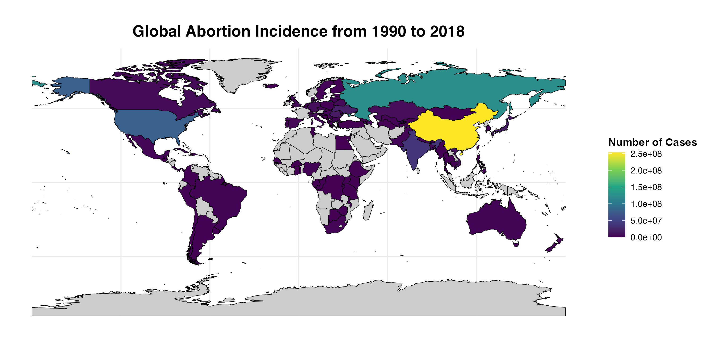
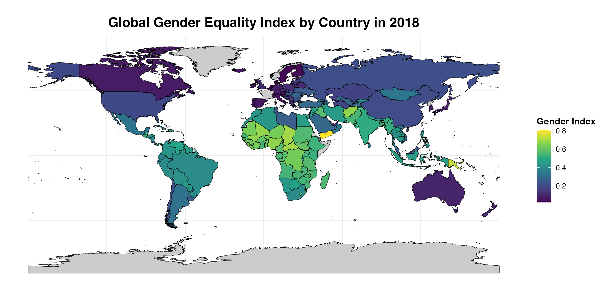
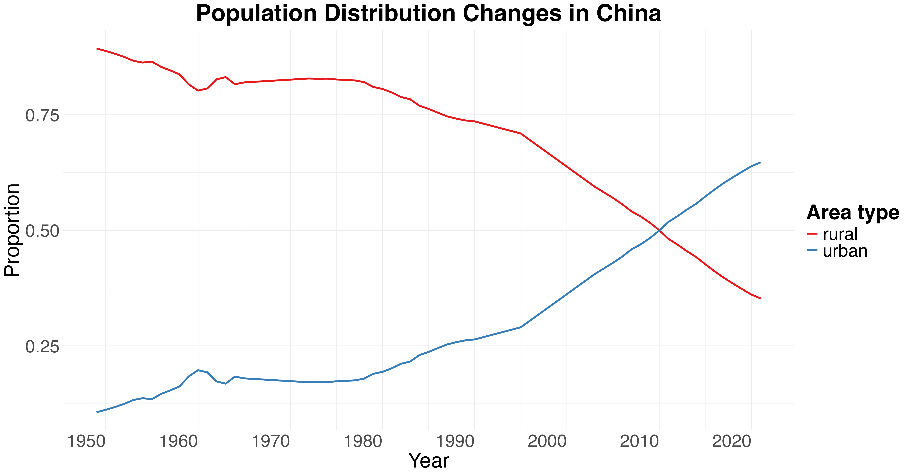

::: {.callout-tip icon=false}
## Github Repo Link

[Tran Chau's Final Project Github Repo](https://github.com/stat301-1-2024-fall/final-project-1-bunmam-ctrl.git)

:::


## Introduction
Overview of the EDA. What was the motivation for this analysis? What initial curiosities or research questions motivated you? Describe the data source(s) you will use to build a predictive model. If you are obtaining information from websites you should cite those in your References.


## Data Overview and Quality
Overview of the EDA. What was the motivation for this analysis? What initial curiosities or research questions motivated you? Describe the data source(s) you will use to build a predictive model. If you are obtaining information from websites you should cite those in your References.

## Explorations

A thoughtful exploration weaves together prose, figures, and tables to help a reader build understanding. It is a guided tour that should have clear motivations for each step in the process (think guiding curiosities or research questions). It should be clear how things build of of each other and why we are looking at what is being presented. Should also be letting the reader know whether what is shown is as expected or is it surprising (maybe some of each).

### Overview
The exploration of global trends regarding `gender inequality` and `abortion rates` highlights a complex interplay between cultural norms, government policies, and access to reproductive health services. The analysis, as presented by @fig-1-global-num and @fig-2-global-gender, unveils a notable case and significant correlations and between these two variables that elucidate the complexities of gender dynamics and reproductive health policies across different regions. 

{#fig-1-global-num}


{#fig-2-global-gender}
 
 
 @fig-1-global-num highlights the global distribution of abortion cases between 1990 and 2018, with **China** standing out as the country with the highest number of reported abortions, indicated by the bright yellow color on the map. The magnitude of abortion cases in China is striking, with **over 250 million cases** reported during this period. The main reason for this high number are deeply rooted in China's historical population policy not only restricted family size but also pressured families into aborting unintended pregnancies to comply with the legal limit. Additionally, societal preferences for male children exacerbated the rate of sex-selective abortions. Despite China's relatively higher standing in terms of gender equality compared to other countries based on @fig-2-global-gender, the high abortion rate suggests that state policies and cultural factors have significantly influenced reproductive choices. ^[https://kingcenter.stanford.edu/sites/g/files/sbiybj16611/files/media/file/kingcenter_issuebrief_china.pdf]

China's situation becomes even more notable when compared to countries in **Northern and Central Europe**, which are known for their progressive gender equality. These regions, indicated on @fig-2-global-gender with significantly **lower GII values (below 0.2)**, also report some of the lowest number of abortion cases globally based on @fig-1-global-num. In contrast, **China with a moderate-to-low-GII (ranging from 0.2 to 0.4)**, exhibits an extremely high number of abortion (@fig-1-global-num). This discrepancy suggests that while Northern and Central Europe's smaller GII aligns with lower abortion rates, China's excessive number of abortions, despite having relatively low GII, may be driven by other factors, such as governmental policies, family, planning history, and healthcare accessibility. 


On the other hand, @fig-1-global-num also demonstrates that many regions in **Africa, Central, South, and Southeastern Asia** have very few reported abortion cases, represented by dark purple. The countries that do report data show relatively low numbers, often below **50 million cases** over the 28-year-period. Thus low incidences can have several implications. One is the possibility of underreporting due to a lack of proper data collection systems and limited access to formal healthcare services where abortions might be recorded. In addition, restrictive abortion laws in many African and Central Asian countries may have driven the practice underground, indicating that actual abortion numbers could be much higher than reported.^[https://www.guttmacher.org/sites/default/files/factsheet/ib_aww-africa.pdf] Cultural and religious attitudes toward abortion, which are often more conservative in these regions, also play a role in shaping these outcomes. As a result, the low reported incidence may reflect barriers to reproductive healthcare access and a lack of autonomy of women regarding reproductive choices. 

Most regions in Africa, Africa, Central, South, and Southeastern Asia exhibit **very high GII values**, as majorly represented by the greenish and yellowish shades in @fig-2-global-gender , with **GII levels often exceeding 0.5**. These regions also report relatively low numbers and missing of recorded abortion cases (@fig-1-global-num). The high gender inequality in these areas suggests limited access to healthcare, low educational attainment, and minimal economic opportunities for women, collectively restricting women's agency over their reproductive choices. This pattern implies a correlation between gender inequality and abortion incidence, where high inequality restricts access to safe reproductive services, resulting in fewer recorder abortions. Moreover, the combination of restrictive abortion laws and prevailing socio-cultural norms, which often limit women rights, further prevents many women from seeking or affording safe abortion service. 

### China

 @fig-1-china-gender-pop, @fig-2-china-gender-pop, @fig-4-china-mean-marriage, @fig-5-china-mean-divorce, and their analyses reveal critical insigits into gender inequality, societal preferences, and their impacts on women choice regarding marriage and family planning in China. 


{#fig-1-china-gender-pop}


{#fig-2-china-gender-pop}

The analysis of the `GII` in China from 1990 to 2021 reveals significant progress in reducing gender disparities. Over the past decades, the GII has steadily decreased, starting at around **0.28 before 2000s** and dropping to approximately **0.18 by 2021** (@fig-1-china-gender-pop). This trend suggests that China has made strides in areas such as education, healthcare, and economic opportunities for women, contributing to overall improvements in gender equality. The reduction in GII reflects both policy efforts and broader societal changes, allowing for greater female participation in multiple domains of life. 

Despite the overall improvement in gender equality, a notable gender imbalance persists, as illustrated by the gender proportion in China from 1950 to 2021. The male population has consistently been higher than that of females, with the `male proportion` hovering around **0.52** and the `female proportion` around **0.48** (@fig-2-china-gender-pop). This discrepancy highlights the persistence of cultural biases favoring sons over daughters, a phenomenon driven by long-standing Confucian values that prioritze male offspring for social and economic reasons ^[https://www.theguardian.com/world/2011/nov/02/chinas-great-gender-crisis]. Such cultural preferences have had a tangible impact on reproductive choices, leading to sex selective abortions that account for China's high abortion rates (@fig-1-global-num). This internalized sexism-favoring the birth of boys over girls-exists despite significant advancements in women's access to eduation and employment opportunities. 


{#fig-4-china-mean-marriage}

{#fig-5-china-mean-divorce}

Marriage and divorce trends in China further reflect evolving gender dynamics and societal changes. Between 2009 and 2017, the `mean marriage rate` in `urban areas` fell sharply from **around 46% in 2013 to 36% by 2017**, while `rural areas` saw a similar decrease from **about 42% to under 34%** (@fig-4-china-mean-marriage). The decline in `marriage rate`, especially in urban settings, indicates a shift in societal attitudes towwards marraige, potentially influenced by increased economic pressures and women's growing independence. Many women may also perceive marriage as lacking emotional and social support, leading them to delay or entire avoid it. Simultaneously, divorce rates in China have been on the rise. `Urban divorce rates` increased from about **10% in 2009 to nearly 16% in 2017**, while `rural divorce rates` also grew from **roughly under 8% to above 12% over the same period** (@fig-5-china-mean-divorce). The increasing divorce rates suggest that women are more willing to exit unsatisfactory marriage, even in rural areas where traditional values often discourage divorce. This trend points to a growing sense of agency among women, supported by better across to resources and legal rights, though it also reflects the challenges they face in finding supportive relationships in a society still influenced by patriachal norms. 

### Africa, and Central, South, and South Eastern Asia
#### Persistent Gender Inequality in Developing Regions: Socio-Political Barriers to Women's Rights

@fig-2-afri-gender-time tracks `GII over time`, from 1990 to 2021, for five countries with some of the highest levels of gender inequality in 2021. These countries — **Afghanistan, Yemen, Central African Republic, Papua New Guinea, and Nigeria** — exhibit persistently high gender inequality levels across three decades, marked by minor fluctuations and few substantial improvements.

**Afghanistan**, for instance experienced a minor increase in its GII from around **0.75** in 2005, reflecting heightened inequality coinciding with periods of intense conflict and shifting political regimes in the 2000s (@fig-2-afri-gender-time). The U.S invasion of Afghanistan in 2001 and the following years of war greatly impacted the social structure, limiting progress in gender equality. Despite, the gradual decline in GII after 2010, the country's GII remained consistently above **0.65**, unveiling the structural challenges continue to hinder gender parity. Furthermore, **Yemen**'s GII hovered between **0.75 and 0.83**, maintaining levels throughout the period (@fig-2-afri-gender-time). The escalation of Yemeni Civil War in 2014 played a pivotal role in maintaining or worsening gender inequality, with limited resources allocated for education and health, disproportionately affecting women rights and opportunities. In 2021, the country's GII approached close to **0.85**, reflecting the continued deterioration of social services, particularly those affecting women right, education, and healthcare.  


{#fig-2-afri-gender-time}


**The Central African Republic (CAR)** also demonstrated a consistently high GII, with values ranging from approximately **0.75** in 1990 to **0.67** in 2021 (@fig-2-afri-gender-time). Despite some gradual improvement, progress has remained largely stagnant, reflecting recurring political instability, governance failures, and limited healthcare infrastructure. The GII saw minimal declines over the decades, showing how persistent socio-political challenges continue to hinder women advancement. The small spike in GGII in the mid 2000s, reaching back to **0.70**, coincides with politic unrest and civil war in the country, which severely impacted the availability of social services, particularly those concerning women and children welfare. **Nigeria**, although showing slightly declining trend, still maintained high GII values, decreasing from around **0.72** in the 1990s to **0.68** by 2021 (@fig-2-afri-gender-time). Regardless of the slight improvements, systemic barriers such as limited access to education and health care services, particularly in rural areas, continue to keep Nigeria among countries with substantial gender inequality. 

**Papua New Guinea** demonstrated the lowest GII among the five countries analyzed, starting at **approximately 0.68** in the early 1990s  (@fig-2-afri-gender-time). Although Papua New Guinea had the lowest gender inequality index in this group, it still fluctuated within a narrow range of **0.65 to 0.68** for more than two decades. In 2012, there was a significant improvement as the GII fell below **0.60**, reflecting some progress toward reducing gender inequality. However, this trend was not sustained, and the most pronounced fluctuation occurred after 2015, when GII values began to rise sharply again to **0.73**. The post-2015 increase in GII coincided with a deterioration in social conditions, which disproportionately affected women. Papua New Guinea's economic challenges intensified, with a lack of significant reforms to promote gender equality in economic participation or political representation. Additionally, cultural barriers and the absence of targeted government policies led to stagnation or even regression in women's rights. The increase in GII after 2015 highlights that although Papua New Guinea might have started with relatively lower levels of inequality compared to the other countries in the figure, there remains a persistent inability to make sustainable progress in addressing gender disparities.


@fig-2-afri-gender-time illustrates how systemic socio-political issues—such as ongoing conflicts, economic crises, and ineffective governance—act as primary barriers to achieving gender equality. These challenges are especially pronounced in the five countries analyzed: Afghanistan, the Central African Republic, Yemen, Nigeria, and Papua New Guinea. These nations exemplify broader regional trends observed in Africa, Central, South, and Southeast Asia, where social instability, economic difficulties, and governance shortcomings hinder gender equality progress. The high GII values in these countries have direct consequences on women's reproductive health and autonomy, as they face restricted access to family planning and reproductive health services, which limits their options for safe abortions, as demonstrated in @fig-1-afri-abor-access. The persistence of high gender inequality across these nations reflects the significant barriers that women face in accessing education, healthcare, and economic opportunities.

#### Educational Inequalities in Developing Regions: Impacts on Women's Rights and Reproductive Health

The distribution of `secondary education completetion rates` by `gender`  highlights notable disparities between males and females in developing regions across Africa, Western, Central, South, and Southeastern Asia. The completion rate for `females` reveals a pronounced right-skewed distribution, peaking between **10% and 30%** of completion. This skew indicates that a significant majority of women do not finish secondary education, with the curve demonstrating a steep decline after the initial peak (@fig-3-afri-compare-edu). Such a skew implies that many women face systemic obstacles in advancing beyond even the early stages of secondary education. The sharp decline and the low overall completion rates underscore how cultural norms, limited financial resources, and institutionalized gender biases directly hinder female educational attainment. As education is a fundamental enabler of personal empowerment and societal progress, this lack of access places women at a severe disadvantage in several dimensions of life, including their capacity for economic independence and decision-making power, particularly around reproductive health. Without the educational foundation to understand and assert their rights, women often face constrained options regarding family planning, leading to increased vulnerabilities related to reproductive health and unplanned pregnancies.

The male distribution exhibits a slightly different trend. The curve for `males` is still right-skewed but shows a broader spread, with its  peaks occuring **around 40% to 60%** of secondary education completion (@fig-3-afri-compare-edu). This pattern suggests that men in these regions are more likely to progress through middle school compared to women, though the rightward skew implies that even for men, many do not reach graduation. The different in the height and the position of the peaks between gender indicates that a larger proportion of men are able to complete their education, but there is still a significant drop-off, particularly after **60%** (@fig-3-afri-compare-edu). This disparity in completion rates between males and females points to deeply ingrained societal norms that prioritize boys' education over girls'. The prioritization of male education reflects a cultural perspective that values men potential economic contributions more highly, while often relegating women to domestic roles with fewer opportunities for economic participating and decision-making power, whereas women remain largely dependent and excluded from such prospects.  

 {#fig-3-afri-compare-edu}


The deficiency of secondary education among women has cascading effects that significantly influence their autonomy and their health. Women with lower education are less likely to be informed about reproductive health services and to have access to family planning methods, which can lead to higher rates of unplanned pregnacies This gap is educational access also reinforces women subordinate status, making the more reliant on male partners and unable to negotiate the terms of their reproductive choices effectively. In regions with substantial gender gaps in education, such as those presented in @fig-3-afri-compare-edu, these socio-cultural factors often contribute to a vicious cycle of poverty, early marriage, high fertility rates, and reduced female labor force participation — all of which further undermine women status.

Finally, the insufficient educational attainment of citizens ultimately hinders social development in these countries. A population with limited education — especially the marked shortage of educated women—restricts overall national progress and curtails opportunities for meaningful economic and social advancement. This educational inadequacy serves as a significant barrier to improving reproductive health services, thereby directly affecting outcomes like maternal health and access to safe abortion services.


## Apendix
### Extra Exploration

{#fig-3-china-area-pop}


```{r}
#| label: tbl-1-china-gender-index
#| tbl-cap: "Decade decline in gender disparity in China from 1990 to 2021"
#
load("figure_china/table_1_china_global_rank.rda")
china_global_rank
```

```{r}
#| label: tbl-1-top-5
#| tbl-cap: "Top 5 Countries with the Highest Gender Inequality in 2021"


load("figure_overview/table_1_top_5_gender_inequality.rda")
top_5_gender_inequality
```
@tbl-1-top-5 lists the countries with the highest GII in 2021, providing specific ranks and highlighting their status in global developmental contexts. The countries listed - Yemen, Papua New Guinea, Nigeria, Afghanistan, and the Central African Republic—feature among the lowest in human development indices and have significant disparities in gender equality.

This table emphasizes the critical link between gender inequality and broader developmental challenges, including those related to health and education. The high ranks in gender inequality correlate with adverse outcomes in reproductive health rights and access, as seen in the abortion trends discussed in @fig-1-global-num. The data underlines the necessity for targeted interventions that address both gender inequality and reproductive health to foster equitable development and improve women’s health outcomes across these regions.


{#fig-1-afri-abor-access}

